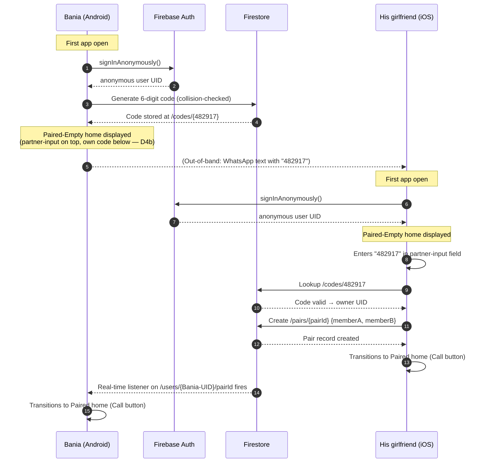
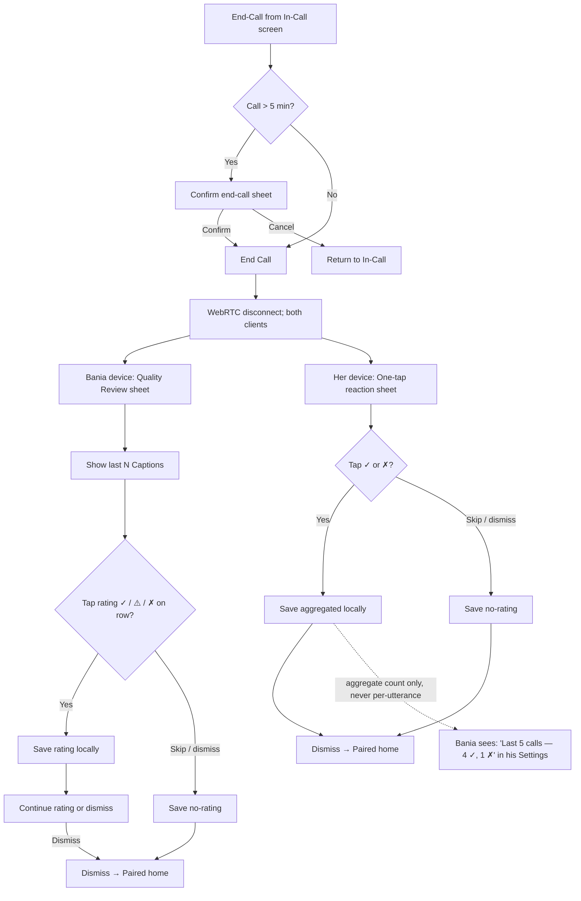

# UX Design Specification TranslatorRep

**Author:** Bania
**Date:** 2026-05-22

---

## Executive Summary

### Project Vision

TranslatorRep is the tool Bania and his girlfriend use instead of WhatsApp when they want a long conversation without translation labor between them. Each side speaks in their native language; both see the other's speech rendered as captions on screen within ~3 seconds, preserving the discourse particles, pronoun register, and Sundanese insertions that carry the emotional content of conversational Indonesian.

The UX exists to maximize the probability that those conversations go well. Everything else — typography, motion, copy, restraint — is in service of that single outcome. The app itself should fade. They should remember the conversation, not the design.

### Target Users

Two specific people in a relationship. Not a market segment.

- **Bania** — Android (Compose), English-speaker, American, ~20s, solo developer/owner. Samsung Galaxy with S Pen [PRD assumption]. Speaks no Indonesian or Sundanese beyond a few words. Reads her translated speech in English; speaks English back.
- **His girlfriend** — iPhone (SwiftUI), Indonesian + Sundanese, ~20s, West Java. Native bilingual code-switcher; lexical Sundanese insertions are her daily pattern. Currently carries the full mental translation load. **Typography note:** Indonesian compound words run long (`kekecewaanku`, `ketidakmampuanku`) — line height, font size, and truncation choices must be validated in Indonesian first, English second.

The design accountability is to these two people. Both will use the app for long voice conversations (UJ-3: ~40-minute deep-conversation calls) in domestic settings, on speakerphone or headset. The tool succeeds when she stops mentally pre-translating before she speaks — and her trust signal is not what *she* sees on her captions; it's how Bania *reacts* to what he sees on his.

### Key Design Challenges

Three sub-problems of one larger problem — "did the conversation work, and could they tell when it didn't?"

**1. Start.** From "I want to talk to her" to "we're talking" must be lower-friction than opening WhatsApp. The hardest part lives upstream of our app — the moment of intent sits inside Bania's WhatsApp habit. The Paired home is one screen, one action; the sharper UX question is how TranslatorRep advertises itself in the friction moment without nagging. Adjacent break points (pairing-code entry, mic permission denial, call-connect failure) sit alongside this — none can be allowed to fail silently or unrecoverably.

**2. Flow.** Once captions are streaming, three things determine whether the conversation keeps going or stalls into self-translation:

- *Reading speed.* Bania must read at her speaking cadence — not 30 seconds behind. Bigger text and fewer simultaneous captions matter more than visual hierarchy.
- *Perceived latency.* The gap between her speech-end and his caption-arrival is dead air WhatsApp doesn't have. Audio-level indicators, partial captions, and "speaking…" signals fill that gap.
- *Caption legibility under monochrome-glass constraints.* Source vs target differentiation by weight and opacity alone — no color hierarchy — inside a layout validated for Indonesian first.

**3. Recover.** Failure is inevitable: full Sundanese clauses (PRD §10.2), network drops, ASR low-confidence, translation 5xx. Recovery requires that *both parties* see the failure unambiguously so the conversation can route around it. Dignified copy ("plain, kind, never apologetic-corporate" per §7) is downstream of visibility. The Sundanese case must render quietly — e.g. `[Sundanese]` placeholder on the EN side, conversation continues, Bania can ask her what she said. Never an alarm banner that makes her feel othered.

### Design Opportunities

**1. The captions disappear when working.** Captions are infrastructure, not brand. Great typography and motion are means; the goal is that they forget the captions exist and remember the conversation. Lean into restraint, not decoration.

**2. Failure visibility as differentiation.** Most translation apps lie by omission. Making failure visible and recoverable — without alarm — is what wins her trust. This is the inverse of most "AI" product UX.

**3. Translation-quality review tool, private to Bania, post-call.** Resolves PRD OQ-7 / DR §Recommendations. Bania flags the last N captions as ✅ / ⚠️ / ❌, feeding the SM-2 quality test and the system-prompt iteration loop. **Critical constraint: she must never see the review surface.** No on-call rating UI, no shared ratings, no notification on her side. If it ever feels to her like he's grading her language, it gets abandoned — and so does the app, through association. Entry point: post-call screen on his device only.

## Core User Experience

### Defining Experience

The single thing users do with TranslatorRep is **have a translated voice conversation.** Concretely, the in-Call loop: she speaks → he reads → he speaks → she reads. Two asymmetric halves of one loop, both must work. Everything else in the product (Pairing, Settings, Quality Review) exists in service of this loop happening, ideally daily.

The Call loop succeeds when neither participant is mentally pre-translating before they speak. The Call loop fails when either falls back to WhatsApp-no-translation as the habit of choice. v1 success is measured at the loop level (SM-1 ≥3×/week, SM-7 deep-conversation signal), not at the screen level.

### Platform Strategy

Locked per PRD §8:

- **Android** — Kotlin + Jetpack Compose, minSDK 33 (required for on-device ASR), target SDK 35.
- **iOS** — Swift + SwiftUI, minOS 17 (`ScrollViewReader` APIs for Caption auto-scroll), target iOS 26.
- **Backend** — Cloud Run (`asia-southeast1`), Node.js, min-instances = 0 with the §6.5 warmup ping pattern.
- **Distribution** — personal sideload only. APK direct install (Android) and TestFlight Ad Hoc (iOS). No Play Store, no App Store.

**Interaction context:**

- Touch-first; no mouse/keyboard cases.
- Voice-only — no video v1.
- Online-only — translation requires network; ASR runs on-device but Caption pipeline needs Cloud Run + Gemini.
- **Both portrait and landscape supported in v1.** Portrait is the default and primary layout (one-handed, propped against a surface). Landscape unlocks the phone-laid-flat-between-users pattern and gives the Caption stack wider rows for long Indonesian compound words — both layouts must be tested with Indonesian source text before English.

**Platform-native capabilities to lean into:**

- **CallKit + PushKit (iOS) / ConnectionService + FCM (Android)** — incoming-Call UI on the lock screen, ring like any other phone Call. Accept without unlocking.
- **System fonts** — SF on iOS, Roboto on Android. No custom typeface in v1.
- **Native blur surfaces** — iOS 17+ ships glassmorphism in the system UI; Compose achieves the equivalent through `RenderEffect` and `BlurEffect` on Android 12+.

### Effortless Interactions

What should feel like nothing, not like a feature:

- **Receiving a Call.** Native lock-screen ring → single tap to accept → app foregrounded in-Call. The user never opens TranslatorRep to receive a Call; the OS does it for them.
- **Reading a streaming Caption.** Auto-scroll keeps the newest Caption in view. Manual scroll-up suspends auto-scroll until the user taps a "jump to latest" affordance or scrolls back down. (FR-19)
- **Speaking your own language.** No language switcher exists. Each side's app is pre-bound to its user's source language at install. The *absence* of a control is itself the effortless thing.
- **Ending a Call.** Single tap on end-Call. Confirmation only triggers on Calls longer than 5 minutes (FR-9), so short Calls feel as fluid as on WhatsApp.
- **Pairing — once.** Six-digit code, typed once, persistent forever (FR-4). Subsequent app launches skip the pairing UI entirely.

### Critical Success Moments

The moments where the product proves itself — or doesn't:

- **First successful Pair (UJ-1 climax).** Both phones confirm the partner; the relationship between devices is formed. A quiet state transition — not a celebration.
- **First translated Caption appears (UJ-2 climax).** Within ~3 seconds of speech. The product proves it works.
- **First emotionally-weighted Caption lands faithfully (SM-7).** When "Aku kangen banget loh" reads as "I really miss you, you know" instead of flat "I miss you so much" — the discourse particle (`loh`) survived. v1 succeeds or fails on this kind of moment, not on call connect.
- **First failure recovered gracefully.** A full Sundanese clause renders as `[Sundanese]` on Bania's side; he asks her what she said; the conversation continues without a stall. This sells the recoverability principle to her over time.
- **First long deep conversation (SM-7 qualitative win).** A ≥20-minute Call where no miscommunication happens; neither falls back to WhatsApp text translation. The qualitative success signal from the brief.

**Critical failure points** — if any of these fail, trust evaporates:

- Call fails to connect on first attempt.
- Lock-screen ring doesn't reach her iPhone (PushKit token revocation, FCM high-priority not honored).
- First Caption never arrives despite both sides speaking.
- Pairing Code typed correctly but Pair fails silently.

Each of these has a graceful-failure UX requirement that downstream Story creation must honor: clear inline error, soft retry, no silent drop.

### Experience Principles

Five principles guide every UX decision in this spec:

**1. The app fades; the conversation comes forward.** No chrome, no decoration, no celebration of the app's existence. They should remember the conversation, not the design.

**2. Read at her speaking cadence.** Caption legibility and reading speed beat visual hierarchy. Bigger text, fewer simultaneous Captions, generous line height — always over denser layouts with more information per screen.

**3. Emotional weight gets a typographic whisper, not a shout.** Captions whose translation hit a preserved discourse particle (TQ-1) or pronoun-register signal (TQ-2) render with subtle weight or spacing variation — a quiet signal that says "this one mattered" without becoming decorated AI. Specifics decided in §"Visual Foundation".

**4. Failure visible to both, in service of recovery.** Never silent drops; never alarm banners. The Sundanese case (`[Sundanese]` placeholder) and the translation-unavailable case (FR-20 indicator) are first-class states, not edge cases.

**5. Native frameworks, identical visual UX.** Compose on Android and SwiftUI on iOS each render the same visual specification — layout structure, element positions, animations, timings, and aesthetic identity are **identical to the eye**. Below the visible surface, each platform uses its native idioms (`NavigationStack` vs `NavController`, `.sheet()` vs `ModalBottomSheet`, native Material blur vs `RenderEffect`). Neither app is a port of the other; both are independent native implementations of the same UX. If Bania and his girlfriend held their phones side by side, they would point at the same spots on both screens.

## Desired Emotional Response

> **A note on evidence quality (per Mary, BMAD BA):** This section's claims about his girlfriend's emotional states are inferred from PRD §2.1, brief §"Who This Serves," DR §6 cultural-pragmatic findings, and Bania's reports — not from her directly. Treat them as design hypotheses, not validated findings. A 10-minute conversation where she reacts to (not approves of) this framing would convert most of it from inference to evidence. Recommended before downstream Story creation.

### Primary Emotional Goals

The single felt success state for v1 is **friction-gone**: a Call where both Bania and his girlfriend forget they are using a tool and remember they are having a conversation. Symmetric, end-to-end. The translation, the captions, the network all dissolve into the background.

"Friction-gone" is a negative goal — it tells you what to remove, not what to compose. Its compositional counterpart is **the medium recedes**: typography wants to be quiet, motion wants to be absent, color wants to be neutral, *because the medium is recovering itself from the foreground.* Friction-gone says "subtract"; the medium recedes says "compose toward stillness." Both are needed.

**Testable definition (not metaphor):** No screen element competes with the speaker's voice for attention during steady-state Call. Walk through any Call screen at any moment and ask: is anything here pulling focus from the audio? If yes, kill it.

Friction-gone is not the same as "she feels understood" or "he feels closer" — both are outcomes that follow from friction-gone but cannot be engineered directly. UX decisions resolve to friction-gone (+ the medium recedes) when they conflict.

### Emotional Journey Mapping

| Stage | Bania should feel | His girlfriend should feel |
|---|---|---|
| Discovery / first install | Quiet competence — a tool that works | Cautious curiosity + a small "he made this for us" signal |
| First Pairing | Small accomplishment, no celebration | Recognition that the relationship now has shape on his side too |
| First Call connect | Focused alertness; reading-mode engages | Mild self-consciousness about her speech being captured |
| First good Caption | Relief + recognition that this is real | Watches *his* face — the trust signal is his reaction, not her screen |
| Long deep Call (SM-7) | Closeness restored | Naturalness; less mental work; freedom to code-switch |
| Failure (Sundanese, drop) | Calm + immediately actionable | Quiet acknowledgement, not embarrassment, not othering |
| Post-Call | Private satisfaction (quality review tool) | Forgets the app exists; optional one-tap reaction available but ignorable |
| Return (next day) | The app is just there, like WhatsApp | Same — habit forming |

### Micro-Emotions

Six micro-emotion deltas determine whether v1 wins her trust or loses it:

- **Naturalness ↔ Self-monitoring anxiety** *(her side, biggest single delta).* She must speak as she normally speaks. The moment she begins watching her own captions and editing her speech for the translator, the loop has failed silently. Three components inside this: self-monitoring anxiety proper (she edits as she goes); receipt-permanence dread (the Call leaves an artifact she didn't author); asymmetric legibility (he sees her words rendered with clarity she can't audit). All three point at the same UX move: agency, not hiding.
- **Trust ↔ Doubt** *(her side, downstream of the above).* Her trust signal is *his reaction*, not what she reads on her screen. The captions she sees are for her own optional verification only.
- **Closeness ↔ Alienation** *(both sides).* Captions risk becoming a glass partition. The UX must position Captions as a bridge — in service of the conversation, not in front of it.
- **Confidence ↔ Anxiety** *(both sides).* Reliability is itself a felt state. Warmup pings, retry indicators, and graceful recovery shape this directly.
- **Recognition ↔ Disorientation** *(her side, emotional moments).* When she says something layered, the translation either preserves the layer or flattens it. The felt difference is "he got what I meant" vs "he heard the words but missed it."
- **Presence ↔ Latency-as-doubt** *(both sides).* The gap between speech-end and caption-arrival is not just performance — it is read as hesitation, doubt, or consideration of how to soften what was said. Latency carries its own emotional signature. Audio-level indicators, partial Captions, "speaking…" cues fill that gap with presence rather than absence.

### Design Implications

- **Friction-gone + medium-recedes → invisibility budget.** Every chrome element, every micro-interaction, every animation must justify its cost. Default to removal. The Caption stack is the one place density is permitted; it earns its weight.
- **Self-monitoring anxiety → agency, not hiding.** Don't bury her captions; give her control over them. Toggle to dim her own captions during a Call. The frame is agency over her words, not hiding from his eyes.
- **Naturalness → no evaluative feedback during a Call.** No "mic too quiet" toast, no "speak slowly please" hint, no progress indicator that implies she's not doing it right. If ASR is struggling, the indicator reads as the app's limit, not hers.
- **Closeness → typography that earns its weight.** Captions use **one weight, one size, one color throughout a Call.** Emphasis — when needed for emotional weight (TQ-1 particle hits, TQ-2 pronoun-register signals) — comes from **spacing, not styling.**
- **Confidence → calm failure states.** Network drops, ASR failures, translation 5xx render as quiet "translation unavailable" markers with soft retry — never alarm banners.
- **Recognition → speaker-side caption visibility, peripheral.** FR-16 ensures the speaker sees what was sent. The typographic expression of "peripheral": lower opacity (≈60% of partner-caption opacity), smaller body size, off-center toward the speaker's mic side. Reassuring without performing.
- **Latency-as-doubt → fill the gap with presence.** Audio-level indicator showing the partner is still speaking; partial-Caption render before final; subtle "thinking…" cue during the brief round trip. The conversation must feel continuous even when the caption isn't yet rendered.
- **Her feedback channel — one-tap, post-Call, ignorable.** The load-bearing user must have a way to signal "this worked / this didn't" that doesn't require effort. Post-Call, on her device only, a single optional tap (✓ / ✗) on the dismissal screen. Recorded locally, surfaced to Bania as aggregated counts — never per-utterance review of her speech. *(v1 scope addition; resolves the "her feedback gap" surfaced by Mary in the Step 4 party review.)*

### Anti-Emotions (Actively Designed Against)

Eight emotional states v1 must not produce. Each is a design veto: any pattern that risks producing one of these is rejected regardless of other merits.

1. **Self-monitoring anxiety** *(her).* No screen, indicator, or interaction can produce the feeling she is being graded, audited, or that her speech is permanent in a way she can't control. Includes the three components above.
2. **Othering — being singled out as the foreign one** *(her).* The Sundanese gap must render quietly (`[Sundanese]` placeholder on the EN side, conversation continues) — never as an alarm banner, never with "language not supported" copy, never with the foreign-language flag visually larger than the English flag.
3. **Performance anxiety** *(her).* No UI element implies she is speaking incorrectly or needs to adjust.
4. **Instrumentalization** *(him).* Bania must not feel the app converted him from speaker into operator — a relay station between her and a translator. The builder lives inside this UX too. Companion to E3 below.
5. **Translation theater** *(both).* The feeling the conversation has become a performance for the translator: shorter sentences, simpler words, dodging idioms, speaking *to the app* rather than to each other. If either starts doing this, v1 has failed silently and no metric will catch it. Design veto on any pattern that rewards "translator-friendly" speech.
6. **App-pride / celebration** *(both).* No confetti, no "Yay! Translated!", no relational-cute micro-interactions. The app does not celebrate itself.
7. **Apologetic-corporate guilt** *(both).* "Translation unavailable" beats "We're terribly sorry."
8. **Pity** *(her).* The app must not feel like a charity built around her language limitation. It must feel like a tool that levels the field — both sides have a translator, both sides are being read.

(The previously listed "AI-app feeling" is demoted to a design rule in §"Visual Foundation" — it is a visual/copy constraint, not an affect, and its enforcement lives in the Forbidden Strings table below.)

### Forbidden Strings (Copy Test)

For each anti-emotion, a concrete example of UI/copy that would surface it. If anything shipping in v1 resembles these, the pattern is rejected:

| Anti-emotion | Forbidden string |
|---|---|
| Self-monitoring anxiety | "Conversation recorded for quality. Session ID: 4f2a-9c1b. Duration: 00:14:32." |
| Othering | "Tap to translate her language" / "Translating Indonesian → English" with the foreign-language flag larger |
| Performance anxiety | "Speak clearly into the microphone" / "Confidence: 72%" shown live on captions |
| Instrumentalization | "You said: [transcript]. Sending to translator…" / any framing that turns Bania into a transcription input |
| Translation theater | UI patterns that reward simpler speech: progress meters that fill faster on short utterances; "good utterance" indicators; visual praise for clean ASR |
| App-pride / celebration | "🎉 First call complete! Share TranslatorRep with friends" |
| Apologetic-corporate guilt | "We're sorry — something went wrong on our end. Our team has been notified." |
| Pity | "Don't worry, we'll help you understand each other" / "Communication made easy for everyone" |
| AI-app feeling *(demoted; visual/copy rule)* | "✨ AI is listening…" / "Powered by advanced neural translation" / a pulsing gradient orb while transcribing |

### Behavioral Signals for Friction-Gone

Two passive, privacy-safe signals to track post-ship, both derivable from Call metadata without content access:

- **Inter-turn gap distribution.** Friction-gone Calls have natural overlap and short inter-turn pauses. Friction-ful Calls have long silent gaps. Track median + p95 inter-turn gap per Call.
- **Call duration distribution.** Friction-gone Calls drift past 20 minutes. Friction-ful Calls die at 6–8 minutes from exhaustion (already gestured at by SM-7).

Composite signal: if average inter-turn gap shrinks across weeks while average Call duration grows, friction is leaving the room.

These belong in the v1 lightweight metadata logging plan. Add to the Architecture phase as a non-functional requirement on Call-metadata logging.

### Emotional Design Principles

Four principles distilled from the above. These pair with §"Experience Principles":

**E1. Friction-gone is the primary; the medium recedes is its compositional pair.** When two design choices conflict, ask which reduces friction across the full Call loop AND composes toward stillness rather than prominence. That one wins.

**E2. She is the load-bearing *user*.** *(Design heuristic, not a finding about her.)* The failure mode that ends v1 is her abandoning the app — through self-monitoring anxiety, othering, performance anxiety, or pity. Every design decision must pass her gut-check before any other optimization. The hypothesis-not-finding distinction (see §"A note on evidence quality") applies.

**E3. He is the load-bearing *builder*.** Bania lives inside this UX for 4–6 weeks of build and indefinitely after. The UX must not make him feel like a servant to the translation, a relay station between speakers, or like he's performing care through technology rather than expressing it. Instrumentalization (anti-emotion #4) is the watch-word.

**E4. The app feels like a phone, not like AI.** No sparkle, no Gemini badging, no AI personality copy. Translation is presented as a property of the Call, not as a feature of an AI product. Enforced through the Forbidden Strings table.

## UX Pattern Analysis & Inspiration

### Inspiring Products Analysis

Seven inspirations organized by what each contributes. The PRD §7 locked the first three; the second four are Caption-stack-specific references added in this workflow.

#### PRD-locked visual touchstones

**1. iOS 26 system UI — Control Center, lock-screen widgets.**
*What it does well:* Monochrome-glass aesthetic at the system level. Backdrop blur as the dominant surface technique. Edge-to-edge layouts with generous safe-area padding. Large hit targets. Calm motion timing. Native typographic hierarchy without color accents.
*What we adopt:* The visual language — translucent panels, backdrop blur, low-opacity 1px borders, system-font typography. The aesthetic identity of TranslatorRep is "this feels like the OS, not like an app on top of the OS."

**2. Bear (notes app).**
*What it does well:* Single-purpose app with typography-first identity. Hierarchy expressed through size, weight, and spacing — never color. Restraint as the brand.
*What we adopt:* Caption-stack typography rules. The principle that "one weight, one size, one color per Call" (per E1 / Design Implications) is a direct lift from Bear's note-rendering discipline.

**3. Linear — but quieter.**
*What it does well:* Restraint inside a productivity tool. Motion timing that feels fluid without being decorative. Command palette polish. Hover states that signal without distracting.
*What we adopt:* Motion and feedback timing — Linear's animation easing, transition durations, and state-change choreography. *Explicitly NOT:* Linear's purple accent color. The PRD locked "fully monochrome" as the chrome — Linear is a structural reference, not a chromatic one.

#### Caption-stack-specific references (added this workflow)

**4. Apple Live Captions (iOS accessibility).**
*What it does well:* Calm system-font typography at large size. Streaming partial-to-final caption transitions without visual jumps. Monochrome. The OS-grade reference for streaming-text UX on Apple platforms.
*What we adopt:* Typography (system-font, large body size, restrained weight) and streaming behavior (partials render in lower contrast, finalize without row reorder).
*What we reject:* The accessibility framing. Live Captions is positioned as an assistive feature; TranslatorRep is a conversational tool. Carrying the accessibility visual language (heavy borders, full-width bars, "Live Caption" badges) would fire anti-emotion #8 (pity).

**5. Subtitled video players (Netflix, VLC, calm-mode YouTube auto-captions).**
*What it does well:* Captions occupy the bottom portion of the screen with content above. Large legible white type on subtle backdrop. Multi-line break behavior tuned for readability. Calm fade-in / fade-out. The category's mature solution for "synchronous text accompanying continuous audio."
*What we adopt:* Caption position (bottom portion of screen, content above), line-break behavior, fade-in pattern on new captions. *Adapt for Indonesian:* the standard 2-line-max convention for English subtitles needs validation against Indonesian compound-word length — may need 3 lines for `kekecewaanku`-class words.

**6. iMessage caption-stack layout (the layout, NOT the chat-bubble container).**
*What it does well:* Rows growing toward the bottom of screen. Auto-scroll to newest. Manual scroll-up suspends auto-scroll until user returns to bottom. "Jump to latest" affordance when scrolled away. Stable row identity prevents flicker when content grows.
*What we adopt:* All of the above behaviors (already echoed in FR-17 / FR-19).
*Explicitly reject:* Chat-bubble containers. Captions are not messages between participants — they are a transcript of a synchronous Call. A bubble container implies asynchronous turn-taking and gamifies the conversation. Captions render as flowing text rows, not chat-bubble objects.

**7. Apple Music — Lock-Screen Now Playing.**
*What it does well:* Ambient-information surface. High-density content (track title, artist, album art, scrubber, playback controls) rendered inside a calm OS-grade frame. The content is dense; the frame is quiet. The page reads as part of the system, not as a third-party app.
*What we adopt:* The "content-dense panel inside a quiet shell" principle. The Caption stack is allowed to be dense (FR-17 / FR-18 / FR-19 / FR-20) precisely because the surrounding chrome is quiet. The total *information density* is balanced; not the density of any one component.

### Transferable UX Patterns

Concrete patterns extracted from the seven inspirations, organized by where they apply:

**Layout / Navigation patterns:**

- *Captions-at-bottom, content-above.* Subtitled video players. Application: In-Call screen. Caption stack occupies lower 60% (PRD FR-17 [ASSUMPTION] — confirmed here), upper 40% holds speaker indicator, mic-active dot, audio level, mute toggle, end-Call button.
- *Edge-to-edge with safe-area padding.* iOS 26. Application: every screen. No side gutters from a card metaphor; content runs to screen edges with minimum 16dp/16pt safe-area padding.
- *Sheet-modal patterns over full-screen navigation.* iOS 26. Application: Settings, Pairing entry, Quality Review tool. Use native sheets (Compose `ModalBottomSheet`, SwiftUI `.sheet()`) over push-navigation for any modal task.

**Interaction patterns:**

- *Streaming text partial-to-final transition.* Apple Live Captions. Application: Partial Caption (FR-18). Partials render at lower opacity / italic; finalize with a weight/opacity transition, no row reorder.
- *Auto-scroll with suspend-on-manual-scroll.* iMessage. Application: Caption history (FR-19). Auto-scroll to newest unless user has scrolled up; show "jump to latest" pill near bottom-right when suspended.
- *Long-press for secondary action.* Native iOS/Android pattern. Application: long-press a Caption row for "flag for review" (private to Bania on his side) or "dim this Caption" (her agency move on her side).
- *Pull-to-dismiss / swipe-to-end.* Native gesture. Application: end-Call gesture as a secondary path to the explicit end-Call button.

**Visual / Motion patterns:**

- *Backdrop blur as the dominant surface.* iOS 26 Control Center. Application: every panel in the app — Call screen control row, Settings sheets, Pairing input panel. Custom equivalent on Android via `RenderEffect` + `BlurEffect` (Android 12+).
- *Linear's motion timing for state transitions.* 200–300ms for primary state changes; 150ms for micro-interactions. Cubic-bezier easing.
- *Bear's typographic hierarchy through size+weight+spacing.* No color hierarchy anywhere in the app.
- *Music Now Playing's "dense content in quiet shell."* Application: the Call screen's Caption stack is the dense content; everything around it is quiet.

### Anti-Patterns to Avoid

Seven anti-pattern sources surfaced during analysis. Each is explicitly rejected:

**1. Google Translate "Conversation Mode."** Chat-bubble framing of utterances feels asynchronous and gamified. Our Captions are *not* messages between participants; they're a transcript of a synchronous Call. Reject the bubble container; reject the "speaker A / speaker B alternating bubbles" framing.

**2. Accessibility-coded live captioning** (Android Live Transcribe, Live Caption phone overlay). High-contrast color blocks, blocky type, "transcription active" badges. Triggers anti-emotion #8 (pity). Even where the typography is well-executed (Apple Live Captions), the *framing* must be rejected.

**3. Zoom / Teams / Meet auto-caption overlay.** White-on-black opaque pill at bottom of video. Utilitarian, broadcast-coded, wrong tone for an intimate conversation.

**4. AI-product visual language** (ChatGPT, Claude, Gemini app, Perplexity, Microsoft Copilot). Sparkle iconography, gradient orbs, "thinking..." animations, purple/blue accents, "AI is listening" disclaimers. Directly violates E4 and the AI-app-feeling Forbidden String row.

**5. WhatsApp's home/chat-list aesthetic.** Busy list-feed shape, green accent, notification dots, badges. The opposite of TranslatorRep — *the very app this product is meant to feel different from.*

**6. Closed-captioning legacy patterns** (CEA-608 yellow-on-black, broadcast TV captioning). Accessibility-coded, broadcast-era, wrong identity.

**7. Otter.ai / general transcription-app conventions.** Chat-bubble UI for utterances, color-coded speakers, "session recording in progress" banner, post-session "playback" mode. Fires anti-emotion #1 (self-monitoring anxiety) and #6 (app-pride — transcription apps love showing off their accuracy stats).

### Design Inspiration Strategy

**What to Adopt — directly:**

- *iOS 26 visual language* — monochrome-glass surfaces, backdrop blur, edge-to-edge, system-font typography. Identity-level adoption.
- *Bear's typographic discipline* — one weight, one size, one color per Call (for Captions). Caption-stack identity.
- *iMessage scroll behavior* (without bubbles) — auto-scroll, suspend, jump-to-latest.
- *Apple Live Captions' streaming-text transition* (without accessibility framing) — partial-to-final visual.
- *Subtitled-video caption position and line-break behavior* — bottom portion of screen, validated for Indonesian compound words.

**What to Adapt — modify for our context:**

- *Linear's motion timing* — adopt the easing and durations; reject the accent color.
- *Music Now Playing's "dense content in quiet shell"* — apply to Caption stack density vs. surrounding chrome quietness.
- *Live Captions typography* — adopt the type rendering; adapt for Indonesian compound words (line height, font size, truncation).
- *Native long-press patterns* — adapt for "flag for review" (Bania-private) and "dim my caption" (her agency).

**What to Avoid — the seven anti-patterns above are explicit rejects.** Each corresponds to one or more anti-emotions in §"Desired Emotional Response":

| Anti-pattern source | Anti-emotion(s) it would fire |
|---|---|
| Google Translate chat bubbles | Translation theater (#5), App-pride (#6) |
| Accessibility-coded captioning | Othering (#2), Pity (#8) |
| Zoom/Teams overlay | Apologetic-corporate (#7), App-pride (#6) |
| AI-product visual language | AI-app feeling (demoted; Forbidden Strings) |
| WhatsApp aesthetic | Friction-gone violation (the app feels like the thing it's replacing) |
| Closed-captioning legacy | Othering (#2), Pity (#8) |
| Otter.ai conventions | Self-monitoring anxiety (#1), App-pride (#6) |

This strategy keeps TranslatorRep recognizably part of the iOS 26 / restrained-software aesthetic family while rejecting the visual languages of every adjacent product category (translation apps, transcription apps, AI apps, accessibility apps, videoconferencing). The product's identity is "a phone call between two specific people, rendered with care" — not "a translation tool."

## Design System Foundation

### Design System Choice

**Native platform design systems, monochrome-themed, fixed dark mode.**

- **Android:** Material 3 (Compose) as the base. Material You dynamic color **explicitly off.** Material 3 component anatomy retained (sheets, snackbars, IconButton, ListItem); color palette and elevation tints overridden toward monochrome glass.
- **iOS:** Apple HIG via SwiftUI native components — `NavigationStack`, `.sheet()`, `Form`, `Button`, `Label`. Use platform standards aggressively. SwiftUI's adaptation to iOS 26 system aesthetics is the cheapest path to the §7 monochrome-glass identity.

This is "platform-native, heavily themed" — not custom-design-system-from-scratch (too expensive at 2-user scale; violates Experience Principle 5), and not cross-platform framework (rejected upstream in TR Step 2).

**Theme mode:** Default dark monochrome; **user-selectable** via Settings between two themes — *Dark* (default) and *Custom image background* (Theme C). Each device chooses independently — themes are local, never synced between Paired Users. System theme is ignored (the app does not follow OS preferences); the active theme comes from local Settings. Implementation overrides `UIWindow.overrideUserInterfaceStyle` (iOS) and `AppCompatDelegate.setDefaultNightMode` (Android) at the application level, with the value sourced from local Settings storage rather than a hard-coded constant. *(Historical: a Light high-contrast Theme B was originally in scope but was removed per Architecture §S3 reconciliation.)*

### Rationale for Selection

**Why native-per-platform.** Experience Principle 5 names this directly: Compose looks Compose-native, SwiftUI looks SwiftUI-native; both render TranslatorRep, neither is a port of the other. Native CallKit / ConnectionService integration (FR-7, FR-8) is also flatly incompatible with cross-platform frameworks at the polish bar PRD §7 demands. A custom design system would re-build platform primitives without adding value at 2-user scale.

**Why Material 3 + HIG specifically.** They are the locally-maximal foundations: familiar to platform users, accessibility built-in, full keyboard/screen-reader/dynamic-type support inherited, and both ship the native blur and motion primitives the §7 aesthetic depends on. Building monochrome-glass on top of them is a theme override, not a re-implementation.

**Why default dark, with Light and Image-bg as user choices.** Dark is the default for two reasons:

1. *Caption legibility under realistic conditions.* Sally's scene from the Step 4 party review — 9pm in Bandung, phone propped against a rice cooker — is dark-mode-coded. Most long-form deep Calls (UJ-3, SM-7) happen in low-light domestic settings. Dark stays the right default for that scenario.
2. *Identity anchor.* Dark is what the app looks like out of the box; it's the canonical spec image. Light and Image-bg are personalizations layered on top of the default identity.

**Why also offer Image-bg in v1** (revising Step 6's original fixed-dark lock per Bania's Step 8 decision; Light high-contrast was subsequently removed per Architecture §S3):

- *Personalization is relational.* For two specific people, letting each choose how the app looks — including putting a photo of the other on the background — is an expression of relationship, not a generic settings feature. Quietly offered as a Settings choice, it stays compatible with the "app fades" principle; it does not become app-pride / celebration.
- *Cost accepted.* Doubles theme-spec scope and screenshot-test scope (vs. the original fixed-dark lock). Bania accepted this trade in Step 8 as a v1 scope expansion. Build economy is no longer the load-bearing argument it was in the original Step 6 lock.

**Trade explicitly acknowledged.** Each user choosing their own theme means the app is no longer literally identical between the two devices when they're using different themes. The "identical to the eye" principle (E5, Step 3) holds for *layout and aesthetic identity per theme*; it does not promise that Bania's Dark-themed screen will look like his girlfriend's Image-themed screen. Identical-when-on-the-same-theme is the v1 contract.

### Design Tokens (Override Layer)

What gets re-themed away from Material 3 / HIG defaults:

| Token | Material 3 / HIG default | TranslatorRep override |
|---|---|---|
| Color palette | M3 primary/secondary/tertiary; HIG accent | **Single monochrome neutral scale** — 4 shades on dark + 2 state colors |
| Typography | M3 type scale; HIG SF Pro | **System font (Roboto / SF) at custom scale validated for Indonesian** — Caption-stack uses one weight, one size, one color per Call |
| Shape | M3 `Shapes` defaults | **Large radius (16–24dp/pt) on sheets and cards; small (4–6dp/pt) inline; no per-component variation** |
| Elevation | M3 elevation tints | **Backdrop blur surfaces only** — no Material elevation color overlays |
| Motion | M3 motion specs | **Linear-grade timing** — 200–300ms primary, 150ms micro, cubic-bezier easing |
| Dynamic color (Material You) | On by default | **Off** — fixed regardless of system accent |
| Theme mode | System-following | **Default dark; user-selectable in Settings** (Dark / Custom image bg) — locked at application level from local Settings, never OS-following |

### State Color Palette (the tiny exception to monochrome)

Per PRD §7: *"color is reserved exclusively for state signals at minimum saturation."* Locked inventory:

- **State A — translation failure / network drop:** muted amber (≈`#B8860B` desaturated). Used by `TranslationUnavailableMarker` and offline indicators.
- **State B — mic-active dot:** muted red (≈`#A52A2A` desaturated), pulsing during active audio capture.

Two state colors total in v1. No success-green, no info-blue, no warning-orange. Any proposal to add a third state color must be re-approved against PRD §7.

### Implementation Approach

**Android (Compose):**

- Custom `Theme.kt` overriding Material 3 `ColorScheme`, `Typography`, `Shapes`, `Motion` tokens. Single `MaterialTheme` block wraps the entire app.
- `RenderEffect` + `BlurEffect` (Android 12+, API 31+) for backdrop blur on `MonochromeGlassPanel`. Fallback to translucent-no-blur on API 30 (below minSDK 33 — not a concern).
- `setDefaultNightMode(MODE_NIGHT_YES)` at `Application.onCreate()`.
- Disable Material You: don't read `dynamicColorScheme(LocalContext.current)`; use static `darkColorScheme(...)` only.

**iOS (SwiftUI):**

- Custom view modifier `.translatorRepStyle()` applying typography, spacing, and shape tokens at the root `App` level.
- Native `Material` thickness presets (`.ultraThinMaterial`, `.regularMaterial`, `.thickMaterial`) for backdrop blur on `MonochromeGlassPanel`.
- `WindowGroup { ... }.preferredColorScheme(.dark)` at the App root.
- No accent color set; native SwiftUI components inherit dark monochrome.

**Both platforms:**

- Design tokens live in a hand-maintained YAML or JSON file (`/design/tokens.yml`) consumed by platform-specific generators at build time, OR kept in sync manually given the 2-user / solo-dev scale.

### Customization Strategy

What gets built on top of M3 / HIG primitives — the **Custom Component Inventory** for downstream Story creation. Most are Caption-stack-related; the rest are pairing/quality-review specific.

| Component | Purpose | Used in |
|---|---|---|
| `MonochromeGlassPanel` | The shared surface primitive (backdrop blur + 1px low-opacity border) | Every panel in the app |
| `CaptionStack` | Lazy scrolling list of Captions | In-Call screen (lower 60%) |
| `CaptionRow` | Source + target text, speaker indicator, emotional-weight spacing variation | Inside `CaptionStack` |
| `PartialCaption` | In-progress streaming render — lower opacity, finalizes without row reorder | Inside `CaptionStack` (live row only) |
| `TranslationUnavailableMarker` | Calm failure-state row (State A amber) | Inside `CaptionStack` (failed-translation rows) |
| `SundanesePlaceholderRow` | Quiet `[Sundanese]` rendering on EN side | Inside `CaptionStack` |
| `JumpToLatestPill` | Bottom-right pill, appears only when auto-scroll suspended | In-Call screen overlay |
| `PairingCodeInput` | 6-digit numeric entry, large hit targets | Paired-Empty home |
| `PairingCodeDisplay` | Own-code display panel | Paired-Empty home |
| `QualityReviewRow` (Bania-side only) | Caption + ✓ / ⚠️ / ✗ tap targets | Post-Call review sheet (his device) |
| `HerSideOneTapReaction` (her-side only) | Single ✓ / ✗ on Call-end dismissal | Post-Call dismissal (her device) |
| `AudioLevelIndicator` | Calm, non-evaluative (no "good utterance" coding) | In-Call screen, upper region |
| `AudioCallControlRow` | Mute audio, audio-routing toggle, end-Call (3-control variant for Audio Calls) | In-Call screen (Audio mode), bottom edge of upper region |
| `VideoCallControlRow` | Mute audio, mute video, flip camera, audio-routing toggle, end-Call (5-control variant for Video Calls) | In-Call screen (Video mode), bottom edge of upper region |
| `CallTypeSelector` | Two-button row: Audio Call / Video Call | Paired home, below partner display name |
| `VideoTile` | Partner's incoming video stream + local PiP corner-overlay | In-Call screen (Video mode), upper 50% |
| `VideoPausedTile` | Neutral-grey "video paused, reconnecting" state | In place of `VideoTile` on video-track failure |
| `VideoMutedTile` | Calm "camera off" state — partner's monogram + display name | In place of `VideoTile` when partner mutes camera |
| `AudioRoutingToggle` | Earpiece / Speaker / Bluetooth cycling button | Inside `AudioCallControlRow` and `VideoCallControlRow` |
| `CameraPermissionFlow` | First-time camera permission sheet with audio-only fallback | Triggered on first Video Call attempt if permission ungranted |
| `E2EEKeyExchangeIndicator` | One-time "End-to-end encrypted" trust signal | Top of In-Call screen on first Call after pairing |
| `RejoinNotification` | Local notification (NOT CallKit re-ring) sent to leaver during 5-min `empty_timeout` | OS notification surface; deep-links back into the room |
| `CallWaitingForPartnerState` | Subtle banner on remaining user's In-Call screen during 5-min `empty_timeout` | In-Call upper region (above Caption stack) |
| `ThemePicker` | Settings control — Dark / Custom image (2-option per Architecture §S3) | Settings sheet |
| `BackgroundImagePicker` | File-picker affordance for choosing a local photo as custom background | Settings sheet (visible only when Image theme selected) |
| `BackgroundImageOverlay` | Adaptive dark tint layer between user-chosen background image and glass panels — ensures Caption legibility regardless of image content | In-Call screen + every screen (when Image theme active) |

Components NOT in v1 inventory (deferred or out of scope):

- Language switcher (per FR-14, each side is pre-bound — no UI exists)
- Avatar / contact-photo rendering (display name only; `VideoMutedTile` uses a monogram from the display name when partner mutes camera)
- Group-call participant tiles (out of scope entirely per PRD §9)
- Tap-to-fullscreen / PiP swap interaction on `VideoTile` (deferred to v1.1)

*(Historical: a "fixed-dark, no theme switcher" lock was earlier in scope but was overridden in Step 8 to add `ThemePicker`. Video calling + `E2EEKeyExchangeIndicator` were earlier deferred to v2 but pulled into v1 per Architecture SCOPE EXPANSION; see Architecture ADR-E5.)*

This inventory is the contract between this UX spec and the downstream Architecture + Stories phases: every screen and state is composed from these custom components plus platform primitives. No screen requires a new component not on this list; if a downstream story claims it does, that's a flag to revisit this section.

## Defining Experience (The Caption Loop)

> Distinct from §"Core User Experience" (which defines the broader in-Call loop). This section zooms into the per-Utterance interaction where TranslatorRep's identity is won or lost.

### Defining Experience — One Sentence

**"Speak your language, watch the meaning arrive."**

The Caption Loop is the per-Utterance flow from speech-onset → partial Caption → finalized Caption → translated Caption on peer's screen. Every other part of the app exists in service of this loop happening reliably and quietly. If the Caption Loop is wrong, the product fails; if the Caption Loop is right, nothing else matters as much.

### User Mental Model

**Bania's model.** Same as a phone call, except a thoughtful interpreter is whispering live English translations of what she said. He *hears* her voice in Indonesian; he *reads* what it means in English. Hearing-language and reading-language stay separate. He scans his Caption stack as the conversation flows, but his primary signal channel is her audio.

**His girlfriend's model.** Same as a phone call, except she knows what she says will be understood. She doesn't actively read his EN translation of her own speech — her own Captions are peripheral (FR-16 / E4 / Step 4 design implications); her trust signal is *his reaction.* When he speaks English, she reads the Indonesian translation on her screen and responds in Indonesian.

**Not the mental model:**

- *Not a chat app.* Captions are not messages between participants. No chat bubbles.
- *Not a transcription app.* The audio is primary; text follows.
- *Not a translation tool.* Translation is a property of the Call, not a feature.

The product is "a phone call between two specific people, with translation."

### Success Criteria for the Caption Loop

- Median speech-end → peer-Caption-final: **<3s** on typical 4G (per SM-4 reconciled target).
- Partial Caption (Android side) or "speaking…" indicator (iOS side) renders within **1s** of speech onset.
- Both speaker and peer see source + target text rendered for every successful Utterance.
- TQ-1 particle preservation hits render with the spacing whisper (visual signal that quality landed).
- Failure cases (FR-20, Sundanese, network) render with calm `TranslationUnavailableMarker` or `SundanesePlaceholderRow` — never silent drops, never alarm banners.
- No row reorder between partial → final transitions; row identity stable.

### Novel vs Established Patterns

The Caption Loop is a **novel combination of established patterns** — not a novel mechanic. No user education needed; every pattern lives in mental models already.

| Pattern | Established source | Used as |
|---|---|---|
| Speaker→listener voice call | Every phone call ever | Container interaction |
| Live partial-to-final captioning | Apple Live Captions | Speech rendering |
| Source + target text pairing | Google Translate (text mode) | Caption row anatomy |
| Auto-scrolling row-stack with manual-scroll-suspend | iMessage | Caption history |
| In-band peer-to-peer text delivery | WebRTC data channels | Translation delivery |

The novelty is the polish bar across all of them, simultaneously, for two specific people.

### Experience Mechanics — The Caption Loop in 9 Beats

Each beat is a UX surface — what the user sees and feels.

**1. Speech onset.** Speaker starts talking. Mic-active dot (State B, muted red) pulses in the In-Call upper region. *Felt as:* the app is listening, calmly.

**2a. Partial Caption — Android speaker.** In-progress source text streams into a single pinned `PartialCaption` row at the bottom of the Caption stack — lower opacity, ASR partials rolling in every ~300–500ms. *Felt as:* the system is keeping up with me.

**2b. "Speaking…" indicator — iOS speaker** *(honest asymmetry).* Whisper.cpp cannot stream true partials. Instead, iOS shows a calm "speaking…" pill + audio-level pulse in the same screen position the partial row would occupy. Same calm-presence intent, different mechanic. *Felt as:* the app is hearing me — even without text yet.

**3. Utterance commit.** 700ms silence detected (FR-12). On Android, partial row transitions to a finalized `CaptionRow` with source text in full opacity. On iOS, the "speaking…" indicator dismisses and a finalized `CaptionRow` appears with the source text. *No row reorder; same row identity (Android) or fresh row appearing in place (iOS).* Felt as: what I just said is captured.

**4. Translation in flight.** Subtle "thinking…" indicator on the in-flight Caption row (no spinner, no shimmer — a single low-opacity dot or weight shift). Round trip ~1.5s typical. *Felt as:* presence, not absence — fills the latency-as-doubt gap from §"Desired Emotional Response."

**5. Translation arrives — speaker's screen.** Target text appears alongside source on the speaker's row. Speaker-peripheral styling (locked Step 4): ≈60% opacity, smaller body size, off-center toward the speaker's mic side. Speaker can verify what was sent without being drawn to it.

**6. Translation arrives — peer's screen.** WebRTC data channel delivers the Caption payload to the peer. Peer's `CaptionStack` appends a new `CaptionRow` with source text (partner's language, lower opacity) + target text (peer's language, full opacity). Fade-in animation, 200ms Linear-easing. Auto-scroll to bottom unless manual-scrolled.

**7. Emotional-weight whisper.** If the translation hit a preserved TQ-1 particle (`lah`, `sih`, `kok`, `dong`, `loh`, `kan`, `mah`…) or TQ-2 register signal, the Caption row renders with slightly increased letter-spacing (≈+0.3pt). *No font-weight change, no color, no animation — just spacing.* Felt as: this one mattered.

**8. Failure case.** Any step 4–6 fails (translation 5xx, timeout, network drop) → `TranslationUnavailableMarker` (State A amber) replaces the target text on both screens. Source text still appears. Long-press the marker → brief explanation ("Network error" / "Translation service unavailable"). *Felt as:* the app is honest with me.

**9. Sundanese clause case.** Source ASR returns text; Gemini system prompt detects full Sundanese clause and flags `[su?]`. EN side renders `SundanesePlaceholderRow` showing `[Sundanese]` in dimmer style; her side still shows the source text. Bania can ask her what she said. *Felt as:* the gap is quiet, not announced. (Specifically designed against anti-emotion #2 — othering.)

#### Additional failure-state beats (per Architecture §7 Failure-State Taxonomy + ADR-F3)

The 9-beat Caption Loop is the happy-path narrative. Architecture §7 enumerates additional failure / asynchronous states that may interrupt or overlay the loop. The state-priority order (highest priority first, enforced cross-platform):

1. **`e2eeKeyNotReady`** — first Call after pairing, before the X25519 ECDH exchange completes. The `E2EEKeyExchangeIndicator` shows briefly. Captions queue until key is established.
2. **`modelLoading`** — first Call after a clean install or app update, while Whisper.cpp / on-device NMT model loads from bundle. Surfaces a one-time "preparing translator" indicator; expected first-time-only.
3. **`waitingForPartner`** — partner left the Call, `CallWaitingForPartnerState` overlay active, 5-min timer counting down. Caption stack continues to render the remaining user's own captions but does NOT push to (absent) peer.
4. **`networkDropped`** — transient network loss. `NetworkDropped` banner active (state-amber); LiveKit reconnect runs; Captions resume on reconnect; failed Captions during the gap render `TranslationUnavailableMarker`.
5. **`translationFailed`** — per-Caption: translation backend (Plan A on-device OR Plan B Vertex AI) returned error. `TranslationUnavailableMarker` replaces target slot; tap reveals reason; retry button if retryable.
6. **`videoPaused`** — Video Call only: video track lost (network or hardware). `VideoPausedTile` (neutral grey, NOT amber) replaces `VideoTile`; auto-retry every 5s + manual retry. Audio continues uninterrupted.
7. **`sundanesePlaceholder`** — per-Caption: `ParticleProcessor` flagged a Sundanese clause that v1 cannot translate. `SundanesePlaceholderRow` shows `[Sundanese]` placeholder.
8. **`asrLowConfidence`** — per-Caption: on-device ASR returned empty or low-confidence. Soft retry surfaces; not silent-drop.

**One-banner-at-a-time rule:** at most one banner-level state renders in the In-Call upper region at any time. Per-Caption markers (`TranslationUnavailableMarker`, `SundanesePlaceholderRow`, inline confidence indicators) continue to render independently — they're per-Caption, not banner-level.

### Mechanics Caveats (forward to Architecture)

- **iOS partial asymmetry** is honest, not hidden. Surface in Architecture as an `AsrProvider` interface property (`supportsStreamingPartials: Bool`) — UI branches on this flag. Caption Loop beats 2a vs 2b are different render paths.
- **Sundanese detection lives in the Gemini system prompt** (DR §"Improved Gemini 2.5 Flash System Prompt"). When the prompt emits `[su?]`, the client renders `SundanesePlaceholderRow` instead of the target text. Architecture must define the payload field that carries this flag.
- **Long Utterances (>15s)** force-segment per FR-12. Each segment becomes its own Caption row in the stack. UX implication: rapid bursts of multiple rows for a long monologue; auto-scroll keeps newest visible.
- **Concurrent speech** (both speak at once) is not specifically designed against in v1 — WebRTC handles the audio; each side ASRs only its own local audio (per Architecture §"Per-participant ASR pattern"). Captions interleave naturally by arrival timestamp. Acceptable for v1; revisit if real conversation testing surfaces problems.

### What Determines Whether the Caption Loop Succeeds

Three things, ranked:

1. **Translation quality** (TQ-1 through TQ-8). If particles drop or register flips, nothing else matters. *Owned by:* PRD §5, DR system prompt, Architecture phase.
2. **Reliability of beats 1–6 firing on every Utterance.** Failure modes must surface per beat 8. *Owned by:* this spec + downstream Stories.
3. **Speed of beats 3 → 6.** Median <3s end-to-end per SM-4. *Owned by:* Architecture (Cloud Run cold-start mitigation, Gemini context caching, data channel reliability).

If those three hold, the Caption Loop succeeds. If any one fails consistently, the Loop is the wrong shape and the rest of the UX cannot save it.

## Visual Design Foundation

### Color System — Two Themes

Each theme is a complete set of foreground/surface/state tokens. Captions remain legible under both, validated for Indonesian text. Cross-references to platform implementation are in §"Design System Foundation > Implementation Approach." Per Architecture §S3 reconciliation: Theme B (Light high-contrast) was removed; only Theme A (Dark, default) and Theme C (Custom image background) ship in v1.

#### Theme A — Dark (default)

| Token | Value | Used for |
|---|---|---|
| `surface-base` | `#0A0A0B` (iOS 26 system dark) | App root background |
| `surface-glass` | `rgba(255,255,255,0.06)` over backdrop blur | `MonochromeGlassPanel` |
| `border-glass` | `rgba(255,255,255,0.08)`, 1px | Glass panel edges |
| `text-primary` | `rgba(255,255,255,0.95)` | High emphasis: titles, partner's target Caption |
| `text-secondary` | `rgba(255,255,255,0.70)` | Medium: body, settings labels, partner's source Caption |
| `text-peripheral` | `rgba(255,255,255,0.60)` | Speaker's own row (FR-16 styling) |
| `text-tertiary` | `rgba(255,255,255,0.38)` | Disabled / low-emphasis |
| `state-amber` | `#B8860B` (muted DarkGoldenrod) | `TranslationUnavailableMarker`, offline |
| `state-red` | `#B85450` (muted red) | Mic-active dot, recording-state pulse |

#### Theme C — Custom image background

The user's chosen photo replaces `surface-base`. Glass panels, text, and state colors overlay it. To preserve Caption legibility regardless of image content, a darkening overlay sits between the image and every glass panel.

| Token | Value | Used for |
|---|---|---|
| `surface-base` | User-chosen local image, scaled to fit screen | App root background |
| `surface-overlay` | `rgba(0,0,0,0.40)` minimum, adaptive up to 0.55 if image is too bright | `BackgroundImageOverlay` — sits between image and all panels |
| `surface-glass` | `rgba(255,255,255,0.08)` over backdrop blur at `.thickMaterial` intensity | `MonochromeGlassPanel` — thicker blur than Theme A to prevent image detail bleeding through |
| Text tokens | Same as Theme A (white-on-overlay) | Foreground reads as if on dark theme |
| State colors | Same as Theme A | |

**Background image constraints:**

- Local-only storage (per Bania's Step 8 decision — never synced between paired devices)
- File-picker selects from device gallery; image stored in app sandbox
- Auto-cropped to fit (object-cover) with safe-area respected
- Default position: center crop
- Single image per device; replacing it removes the prior one

**Implementation note on the adaptive overlay:** A simple v1 implementation uses a fixed `0.40` overlay opacity. If real testing shows Caption legibility issues against high-key (very bright) photos, escalate to adaptive — sample the average luminance of the screen region behind the Caption stack and adjust overlay opacity from `0.40` (dark images) to `0.55` (bright images). Defer to Architecture phase.

#### Theme C × Video Interaction

When a user is on Theme C (custom image background) AND in a Video Call:

- **Audio Call under Theme C:** the custom image background renders full-screen with the adaptive `BackgroundImageOverlay` (0.40 → 0.55); glass panels and Caption rows overlay normally per Theme C tokens.
- **Video Call under Theme C:** the partner's video stream **replaces** the custom image in the upper 50% region (the `VideoTile`). The lower 50% Caption-stack region continues to render the custom image with the adaptive overlay underneath glass panels.
- No setting is required — the handoff happens smoothly at video track activation (Story 6.4 / Architecture ADR-E2).
- The adaptive overlay (0.40 → 0.55 luminance-sampled) applies only to the Caption-stack region when Theme C × Video is active. The video region needs no overlay since it does not host text.
- Forward-reference: implementation lives in `BackgroundImageOverlay` component + `VideoTile` component; cross-cutting choreography in Architecture ADR-E2.

### Typography System (Identical Across Both Themes)

System fonts only — **SF Pro Text (iOS)**, **Roboto (Android)**. No custom typeface. Sizes, weights, and spacings are identical across themes; only the foreground color token changes per theme.

| Role | iOS | Android | Used for |
|---|---|---|---|
| Display | 48pt Regular | 44sp Regular | Pairing Code, large numerals |
| Title | 28pt Semibold | 24sp Medium | Screen headers |
| **Caption-primary** | **22pt Regular** | **20sp Regular** | Partner's target Caption text |
| Caption-peripheral | 18pt Regular | 16sp Regular | Speaker's own row |
| Caption-source | 16pt Regular | 14sp Regular | Source text alongside target |
| Body | 17pt Regular | 16sp Regular | Settings, privacy summary |
| Footnote | 13pt Regular | 12sp Regular | Timestamps, status text |

**Line height:** 1.4× for all `Caption-*` roles (validated for Indonesian compound words). 1.3× for Body and Title.

**Emotional-weight letter-spacing** (per E1 / Step 3): TQ-1 particle and TQ-2 register preservation hits render with `+0.3pt` tracking. *No weight change, no color, no animation — just spacing.*

**Dynamic Type / font scale:** Body and Title sizes respect iOS Dynamic Type and Android system font scale. Caption-* sizes scale ±2 Dynamic Type steps but clamp to [18pt, 28pt] (iOS) / [16sp, 26sp] (Android) to preserve reading-speed targets from §"Desired Emotional Response."

### Spacing & Layout (Identical Across Both Themes and Both Platforms)

**Base unit:** 4pt/dp. Spacing scale: 4 / 8 / 12 / 16 / 24 / 32 / 48 / 64. No in-between values.

**Safe-area padding:** 16pt/dp minimum on every screen edge.

**In-Call screen vertical split:**

| Mode | Upper region | Lower region |
|---|---|---|
| Audio Call | **40%** — partner display name + `mic-active dot` + `AudioLevelIndicator` + `AudioCallControlRow` (mute audio / audio-routing toggle / end-Call) | **60%** — Caption stack (confirms PRD FR-17) |
| Video Call | **50%** — `VideoTile` (partner's video stream) + corner-overlay PiP for local self-view + `mic-active dot` + `AudioLevelIndicator` + `VideoCallControlRow` (mute audio / mute video / flip camera / audio-routing toggle / end-Call) | **50%** — Caption stack |

**Explicit reject:** backdrop-video-with-captions-overlay (video behind captions). Violates UX anti-emotion #5 (translation theater) — captions on her face during emotional moments creates the wrong frame.

**Touch targets:** 44pt iOS / 48dp Android minimum on every interactive element (WCAG AAA mobile compliance).

**Backdrop blur intensity:**

| Surface | iOS | Android |
|---|---|---|
| In-Call control row (Theme A) | `.thickMaterial` | `RenderEffect.createBlurEffect(24f, 24f)` |
| Sheets and panels (Theme A) | `.regularMaterial` | `RenderEffect 16f` |
| Caption stack subtle wash (Theme A) | `.ultraThinMaterial` | `RenderEffect 8f` |
| All panels (Theme C image-bg) | `.thickMaterial` everywhere | `RenderEffect 24f` everywhere |

Theme C uses thicker blur uniformly to prevent image detail from bleeding through into glass panels.

### Platform Parity Specification

Per Experience Principle 5 (revised Step 8) — both platforms render the same visual specification, identical to the eye. This subsection defines what "identical" means:

**Identical across platforms:**

- Screen layouts (vertical splits, region sizes, anchor points)
- Element positions (where the mic dot lives, where end-Call sits, where the Caption stack starts, where Settings icons live)
- Animation timings (200–300ms primary, 150ms micro, cubic-bezier easing)
- Fade-in / fade-out patterns
- Caption row anatomy (source layout, target layout, peripheral styling, particle spacing)
- Color token values, per theme
- Spacing values
- Touch target sizes

**Diverges by platform (acceptable, below the user-visible layer):**

- Navigation primitives (`NavigationStack` vs `NavController` + Compose Navigation)
- Modal presentation (`.sheet()` vs `ModalBottomSheet`)
- List/scroll primitives (`LazyVStack` + `ScrollViewReader` vs `LazyColumn` + `rememberLazyListState`)
- Blur APIs (native `Material` thicknesses vs `RenderEffect` blur radii)
- Incoming-Call native UI (CallKit + PushKit vs ConnectionService + FCM)
- Audio capture callbacks (`AudioCustomProcessingDelegate` vs `AudioBufferCallback`)

**Identical-when-on-the-same-theme contract:** The "identical to the eye" promise holds when both devices are on the same theme. If Bania chooses Dark and his girlfriend chooses Image background (per Step 8 decision: themes are per-device, independent), the two screens will look different from each other — but each screen still matches its platform-paired theme spec.

### Accessibility Considerations

- **Contrast:**
  - Theme A primary text on `surface-base` measures >15:1 (WCAG AAA).
  - Theme A peripheral text (0.60 opacity) still meets WCAG AA 4.5:1.
  - Theme A state colors verified ≥4.5:1.
  - Theme C: `BackgroundImageOverlay` ensures effective text contrast ≥4.5:1 against the darkened image; thicker glass blur further protects the Caption stack.
- **High Contrast** (iOS *Increase Contrast* / Android *High Contrast Text*): Theme A deepens — primary text moves to 1.0 opacity, peripheral text moves to 0.85. State colors saturate slightly. (Theme C image-background: overlay opacity bumps to 0.55 to preserve contrast.)
- **Dynamic Type / font scale:** supported with clamping on Captions (see Typography System above).
- **VoiceOver / TalkBack:**
  - Caption rows are accessible elements with semantic labels: *"Bania said: 'I love you.' Translated: 'Aku cinta kamu.'"*
  - **Captions are NOT auto-announced during a Call** — the audio is already there; auto-announce would create a third audio layer interfering with the conversation. The user can explicitly navigate the Caption stack to hear past captions.
  - VoiceOver hints avoid AI framing (per E4): *"Translation provided by the Call"*, never *"AI translation"*.
- **Reduced Motion** (iOS) / **Remove Animations** (Android): Linear-grade timings reduce to ≤80ms; fade-in animations skip; auto-scroll becomes jump-scroll.
- **Color-blindness:** not a v1 risk (we're monochrome; state colors are luminance-distinct as well as hue-distinct).
- **One-handed reach** (portrait): primary actions live in the lower 40%, reachable from natural thumb arc.
- **Theme switching accessibility:** the `ThemePicker` in Settings is a labeled list with explicit theme names; not an icon-only toggle. Image-theme requires explicit file-picker action (no auto-select).

### Forward to Step 9 (Design Directions)

Two concrete design directions to mock up in Step 9:

1. **Default Dark** — the canonical look. Caption stack at 9pm in a quiet room.
2. **Custom image background (with a placeholder photo)** — shows how the overlay, thicker blur, and Caption legibility hold up against a real image. Use a stock photo for the spec mock; Bania substitutes his own at runtime.

## Design Direction Decision

### Design Directions Explored

Six direction combinations were evaluated across four open axes (Caption row anatomy, speaker indicator style, In-Call upper-region layout, Paired-Empty home layout). Themes were treated as user-selectable Settings (per Step 8), not as competing directions — Theme C (Image) is layered on top of the chosen layout direction. *(Historical note: a Theme B Light high-contrast option was originally explored — direction #4 in the table below — but was removed per Architecture §S3 reconciliation; only Dark and Image-bg remain in v1.)*

| # | Name | Theme | Caption order | Speaker indicator | Upper region | Pairing home | Verdict |
|---|---|---|---|---|---|---|---|
| 1 | Canonical Dark | A | Source top | Luminance only | Centered | Own code top | **Strong default** |
| 2 | Meaning first | A | Target top | Luminance only | Centered | Own code top | Plausible alternative; rejected for convention |
| 3 | Status-bar Pragmatic | A | Source top | Inline labels | Status bar | Partner input top | Rejected — violates luminance-only lock |
| 4 | Light high-contrast | B | Source top | Luminance only | Centered | Own code top | ~~Ships as Theme option~~ **Removed per Architecture §S3 reconciliation; row retained for historical record** |
| 5 | Custom image (stock) | C | Source top | Luminance only | Centered | Own code top | Ships as Theme option, not standalone direction |
| 6 | Conversation-as-flow | A | Side-by-side | Luminance only | Centered | Own code top | Rejected — chat-log association |

### Chosen Direction — "Direction 1 + D4b" (Canonical with partner-input-first pairing)

The canonical reference rendering for TranslatorRep — the way every screen is rendered in the spec, in design comps, and in v1 Story creation. Theme C (Custom image background) is a user-selectable variation of this same direction; it does not replace it. *(Historical: Theme B Light high-contrast was originally also a user-selectable variation but was removed per Architecture §S3 reconciliation.)*

**Locked layout decisions:**

- **D1a — Source on top, target below.** Conventional subtitle reading order. Source text in `text-secondary` opacity; target text in `text-primary` opacity. The reader's eye flows top→bottom following the speech-to-meaning arc.
- **D2c — Luminance-only speaker indicator.** Speaker's own row renders at `text-peripheral` opacity (~60%), smaller body size, right-aligned (off-center toward the speaker's mic side). Partner's rows render at full opacity, full size, left-aligned. No text labels, no name tags, no color coding. The asymmetry IS the indicator.
- **D3a — Centered minimalist upper region.** Partner display name centered top; mic-active dot (state-red, pulsing) and audio-level indicator below the name; `AudioCallControlRow` (mute audio, audio-routing, end-Call) at the bottom edge of the upper region for Audio Calls; `VideoCallControlRow` (5 controls including video-mute and camera-flip) for Video Calls. The Caption stack starts immediately below.
- **D4b — Partner-input-first Paired-Empty home.** Partner-code input field is the first thing the user sees after sign-in; own code display sits below it. Rationale: entering the partner's code is the *active* user task; displaying your own code is *passive* (the partner needs it on the other device). Foregrounding the action over the artifact reduces time-to-pair.

### Design Rationale

**Why Direction 1 (Canonical) over Direction 2 (Meaning first):** Source-on-top is the universal subtitle/captioning convention — every reference in §"UX Pattern Analysis" (Apple Live Captions, Netflix subtitles, iMessage layout) places the speaker's words above the listener's perception. Inverting the convention without strong user-research evidence would introduce cognitive friction in the Caption Loop's most load-bearing moment. The "watch the meaning arrive" mental model from Step 7 is preserved through dimmer source styling + full-emphasis target; we do not need to invert the spatial order to communicate it.

**Why D4b (partner-input-first) over D4a (own-code-first):** Tested against UJ-1 (first-time pairing): when Bania opens his app for the first time and his girlfriend has sent him her code via WhatsApp, the action that brings him closer to "we're paired" is entering her code. Displaying his own code is the passive surface that exists for *her* to see when she opens her app and follows the same flow. Foregrounding the active task reduces friction; the passive code display still sits below in clear view.

**Why no chat-bubble container (rejected D2b-like patterns):** Captions are not messages between participants. A chat-bubble container — even subtly styled — would trigger anti-emotion #5 (translation theater) by making the conversation look like an exchange of text rather than a phone call with translation. The luminance-only speaker indicator + flowing-text-row layout preserves the "phone call, not chat" mental model.

### Implementation Approach

The canonical direction is implemented as the default layout for every screen. Theme C (Image-bg) re-renders the same direction with different color tokens and surface treatments per §"Visual Design Foundation." *(Historical: Theme B Light high-contrast was also a planned re-rendering; removed per Architecture §S3.)*

**Mockup deliverable:** [`ux-design-directions.html`](./ux-design-directions.html) — a static HTML file showing the canonical direction rendered in all three originally-explored themes, on the two load-bearing screens (In-Call and Paired-Empty home). Open in any modern browser to view. The mockup is for Bania's pre-build visual verification and as a reference asset for Story creation; it is not a deployable artifact. *(Note: the HTML mockup is now stale post-reconciliation — it predates Theme B removal and Video Call layout. The HTML file is being marked stale separately; only Dark and Image-bg renderings remain canonical.)*

Mockup contents:

- **In-Call screen × 3 themes (stale post-reconciliation — Dark + Image are canonical, Light is historical)**, with sample captions for: a normal partner-speaking Caption row; a peripheral speaker-self row (≈60% opacity, smaller, right-aligned); a particle-preservation row (TQ-1, "Aku kangen banget loh" → "I really miss you, you know" with +0.4px letter-spacing); a `TranslationUnavailableMarker` (state-amber); and a `SundanesePlaceholderRow`.
- **Paired-Empty home × 3 themes (stale post-reconciliation)**, showing partner-input-first layout per D4b — input field + Pair button above, own code below the divider.

Forward to Step 10 (User Journeys): the direction locked here is the visual frame inside which every UJ flow renders.

## User Journey Flows

> Foundation: PRD §2.4 UJ-1/UJ-2/UJ-3 + Step 4 new v1 surfaces (quality review, one-tap reaction) + Step 7 Caption Loop. Each flow below covers the happy path and the named failure branches. Implementation references (LiveKit SDK calls, Firebase Admin API, etc.) live in the PRD Addendum and downstream Architecture; flows here are user-facing only.

### UJ-1: First-time Pairing

The moment the relationship between devices is formed. PRD UJ-1 climax: both phones show the partner's pairing confirmation.



**Happy path mechanics:**

- Each user sees the Paired-Empty home with partner-input field foregrounded (D4b) and their own code displayed below the divider.
- Pairing is committed when either user enters the other's code. Both devices transition to the Paired home (Call button) within 5 seconds of the pair record creation (FR-3).

**Edge cases (must be handled by FR-3):**

- *Mistyped code.* Inline error message ("Code not found") within 2 seconds. The original code remains valid; she retypes without him regenerating.
- *Code collision* (1M space, vanishingly rare). FR-2 enforces collision check at generation time — collision returns "Please try again" and regenerates one digit.
- *One user paired, other not yet.* The user who entered the code transitions to Paired home immediately; the code-owner transitions on the real-time listener (typically <1s; up to FR-3's 5s ceiling).
- *Self-pair attempt* (user enters their own code). Backend rejects: "That's your own code." No error sheet — inline message.

### UJ-2: First Call

PRD UJ-2 climax: the first translated Caption appears for both of them in real time.

```mermaid
sequenceDiagram
    autonumber
    participant B as Bania (Caller)
    participant CR as Cloud Run
    participant LK as LiveKit Cloud
    participant FCM as APNs / FCM
    participant G as His girlfriend (Callee)

    B->>B: Taps Call on Paired home
    B->>CR: POST /call-init (App Check + ID token)
    CR->>LK: Create room, mint short-lived JWTs
    LK-->>CR: Room ID + JWTs
    CR->>FCM: VoIP push (priority 10) → her device
    CR-->>B: JWT (caller)
    B->>LK: Connect to room (caller joins)

    FCM-->>G: VoIP push received
    G->>G: PushKit/APNs → CXProvider.reportNewIncomingCall (synchronously)
    G->>G: Native CallKit ring-on-lock-screen ("TranslatorRep — Bania")

    Note over G: User taps Accept from lock screen
    G->>CR: POST /call-accept (App Check + ID token)
    CR-->>G: JWT (callee)
    G->>LK: Connect to room (callee joins)

    Note over B,G: Both in-Call; audio flowing
    Note over B,G: Caption Loop begins (see § "Defining Experience — The Caption Loop")
```

**Happy path mechanics:**

- Tap-to-ringing latency: <3s on 4G (FR-6 / FR-7).
- Caller sees "Calling…" state until accepted, rejected, or 30s timeout.
- Callee accepts from lock screen — no unlock required (FR-7).
- Both devices transition to In-Call screen within 2s of accept (FR-8).

**Edge cases:**

- *Callee rejects.* Caller sees "Call declined", returns to Paired home within 3s.
- *Callee doesn't respond within 30s.* Caller sees "Call missed"; callee's Recent log (if implemented) shows the missed Call.
- *FCM/APNs delivery fails.* Caller's "Calling…" times out at 30s. Callee gets no notification (silent failure on her side, but the PushKit canonical pattern is strictly followed to minimize this).
- *Caller has no mic permission.* Inline error before /call-init request: "Mic permission required to start a Call" → tap to open Settings deeplink.
- *Network unavailable on either side.* Caller sees "No connection — try again"; callee never receives push.

### UJ-3: The Deep Conversation

Not a separate flow diagram — UJ-3 is a steady state *inside* UJ-2's in-Call. The detailed per-Utterance mechanics live in § "Defining Experience — The Caption Loop" (9 beats, including the Sundanese placeholder and TranslationUnavailableMarker cases).

**What's UX-distinctive about UJ-3 vs UJ-2:**

- UJ-2 is a verification moment ("the product proves it works"). UJ-3 is a habituation moment ("the product disappears into use").
- By UJ-3, both users have stopped looking at the Caption stack defensively. The mic-active dot, the audio-level indicator, the speaker-peripheral row — all read as ambient calm rather than performative.
- The TQ-1 particle-spacing whisper (Caption Loop beat 7) starts paying off here: by call #20, she notices that her `loh` and `kan` particles land as feeling-laden English, not flat. Her trust signal — *his reaction* — is what tells her.

No FRs special to UJ-3 beyond those already in UJ-2. SM-7 (the qualitative win) is the success measure.

### Post-Call: Bania's Quality Review (his side, private) + Her One-Tap Reaction (her side, optional)

The asymmetric post-Call surfaces locked in Step 4 design implications.



**Asymmetry — the load-bearing detail:**

- *His side*: per-utterance ratings of the last N captions. Granular. Feeds the SM-2 quality acceptance test and the system-prompt iteration loop.
- *Her side*: a single ✓ / ✗ on the whole Call. Aggregate. Surfaces to him as counts ("4 of 5 ✓") — *never as per-utterance review of her speech*.
- The two surfaces never see each other. She does not know his review tool exists; he does not see her per-utterance ratings (because there are none).

**Edge cases:**

- *Either dismisses immediately* — both surfaces are skippable. Skip is treated as "no signal," not "neutral."
- *Bania abandons his review mid-flow* (e.g., locks phone) — partial ratings saved; remaining captions can be reviewed later from a Settings entry point.
- *Aggregate disagreement* (he marks 4 ✓, she marks ✗) — both stored. The disagreement itself is signal for prompt iteration; no resolution UI in v1.

### Mid-Call: Translation Failure Recovery

The Caption Loop's beat 8 and beat 9, drawn as a flow.

```mermaid
flowchart TD
    A[Speech onset] --> B[On-device ASR]
    B --> C{ASR result?}
    C -->|Empty / low conf| D[Soft retry indicator on speaker's pending row]
    D --> E[3 retries reached?]
    E -->|Yes| F[TranslationUnavailableMarker]
    E -->|No| B
    C -->|OK| G[Source text → Cloud Run]
    G --> H{Translation result?}
    H -->|Network error / 5xx / timeout| F
    H -->|OK| I{Gemini flagged 'su?'}
    I -->|Yes| J[SundanesePlaceholderRow on EN side]
    I -->|No| K[Normal CaptionRow source + target]

    F --> L[Both sides see marker amber state]
    L --> M[Long-press: 'Network error' or 'Translation service unavailable']
    L --> N[Conversation continues; no silent drop]

    J --> O[EN side sees '[Sundanese]'; ID side sees source]
    O --> P[Conversation continues; Bania can ask 'what did you say?']

    K --> Q[Both sides see Caption; conversation flows]
```

**Calm-failure mechanics:**

- Failure always renders something. Source text remains visible whenever ASR succeeded; only the target replaces.
- No alarm, no banner, no push notification. The Caption stack just shows the marker in the next row position it would have used.
- Long-press the marker for a one-line explanation ("Network error" / "Translation service unavailable") — surfaced calmly, not as a debug log.
- The Sundanese case is *not a failure* — it's a v1 limitation rendered with dignity. `[Sundanese]` reads in dim italic, no error styling.

### Unpair Flow

FR-5: two-tap confirmation; backend deletes the pair record; the other side learns of the unpair on next Call attempt (per PRD § "FR-5 Consequences").

```mermaid
flowchart TD
    A[Settings sheet open] --> B[Tap 'Unpair from Mira']
    B --> C[Confirm sheet: 'Unpair? You can re-pair later.']
    C -->|Cancel| A
    C -->|Confirm| D[Second confirm: 'This will end the pairing.']
    D -->|Cancel| A
    D -->|Confirm| E[Backend: Delete /pairs/&#123;pairId&#125;]
    E --> F[Local: clear pairing state, partner display name]
    F --> G[Navigate to Paired-Empty home]

    E -. Firestore listener fires .-> H[Her device: silently updates pairing state]
    H --> I[Her next Call attempt → 'Partner unpaired' message]
    I --> J[Her device: return to Paired-Empty home]
```



**Mechanics:**

- Two-tap confirm pattern matches PRD FR-5: no single-tap destructive action.
- The other user is not notified immediately (no "Bania unpaired you" notification — that would be either dramatic or surveillance-coded). She finds out only on her next Call attempt or when she opens the app and sees her Paired home is missing the partner.
- If she's in the middle of an active Call when he unpairs, the active Call continues (LiveKit room remains); the unpair takes effect when she leaves the Call.

### Journey Patterns (Reusable Across Flows)

- **Sheet-modal pattern for every settings-level action.** Unpair, Theme picker, Quality Review, Privacy summary, Background image picker. Native `.sheet()` (iOS) / `ModalBottomSheet` (Android). Never full-screen navigation for these.
- **Two-tap confirmation for destructive actions.** Unpair (FR-5), end-Call on Calls >5 minutes (FR-9 `[ASSUMPTION]` — confirmed by spec). Never single-tap destructive.
- **Real-time backend listeners for cross-device state.** Pair creation (UJ-1), pair dissolution (Unpair), incoming-Call notifications. Both devices reflect change within seconds.
- **Native OS integration for ambient surfaces.** CallKit / ConnectionService for incoming-Call ring. The app never wakes a "we're trying to call you" sheet — the OS does.
- **Calm failure-state rendering.** Every flow has a failure branch; every failure branch surfaces a calm marker, never an alarm. Recovery is always available.
- **Asymmetric privacy surfaces.** Bania's review on his side; her one-tap on her side; aggregated counts only between them. Pattern applies to any future post-Call telemetry.

### Flow Optimization Principles

1. **Minimize steps to value.** Pair: one code entry. Call: one tap. Caption Loop: begins on speech. No wizards, no progressive-disclosure walls, no "Welcome to TranslatorRep — let's set up your profile" screens.
2. **No modal interrupts during a Call.** Settings, post-Call surfaces, and pre-Call flows can use sheets; the in-Call screen has no popups, no "are you sure" interruptions during conversation.
3. **Recovery from every failure to a known-good state.** Every flow's failure branch returns the user to Paired home, Paired-Empty home, or the active conversation. Never a stuck state.
4. **No fork-in-the-road decisions during a Call.** Once the Call starts, the user's only meaningful actions are speak, mute, end. Quality review, theme changes, settings — all post-Call.
5. **Native OS handles ambient state.** Lock-screen ring (CallKit), background notifications (APNs/FCM), incoming-Call UI — let the OS do it. The app does not reimplement these.

### Open Journey Questions (Forward to Architecture / Stories)

- **Caption history view during a Call.** Auto-scroll suspends on manual scroll-up (FR-19); is there a "scroll all the way to start of Call" affordance, or only a "jump to latest" pill? Story-level decision; default: only the latter.
- **Theme picker placement in Settings.** Top section, near privacy summary, or in its own dedicated row? Story-level.
- **Background image picker copy.** What does the file-picker label say? ("Choose a photo" — Body voice per §"Desired Emotional Response", no relational-cute framing.) Story-level.
- **Re-pair workflow.** After Unpair, can the user re-pair with the same partner just by entering the same code, or does the code need to be regenerated? Default: code remains valid until explicitly regenerated (per FR-2 consequences).

## Component Strategy

### Foundation Components (from Material 3 / Apple HIG)

What we inherit and use directly without re-implementation:

| Foundation | Used for |
|---|---|
| `Button` / `Button.swiftUI` | All non-Caption tap targets |
| `Sheet` (`.sheet` iOS / `ModalBottomSheet` Android) | Settings, post-Call surfaces, theme picker, unpair confirm |
| `NavigationStack` / `NavController` | Top-level navigation between Paired-Empty home, Paired home, Settings, In-Call |
| `TextField` / `TextField.swiftUI` | Settings inputs (display name) — *not* used for Pairing Code (custom component) |
| `Toggle` / `Switch` | Settings on/off rows (transcript history, post-editor, Crashlytics opt-in) |
| `ListItem` / `Form` row | Settings list rows |
| `Snackbar` / inline-error banner | Inline errors (mistyped code, mic permission denial) |
| `Material` / `RenderEffect` blur | Backdrop blur on `MonochromeGlassPanel` |

These do not need spec; their behavior is the platform's.

### Custom Components — Specifications

Listed in roughly load-bearing order. Each component gets: Purpose · Anatomy · States · Variants · Accessibility · Interaction.

---

#### `MonochromeGlassPanel`

The shared surface primitive that every panel in the app composes from.

- **Purpose.** A translucent surface with backdrop blur, low-opacity 1px border, and theme-aware color tokens. The visual identity primitive.
- **Anatomy.** Backdrop blur layer (depth varies per theme + position) → translucent fill (`surface-glass`) → 1px `border-glass` border → content slot.
- **States.** Default. (No interactive states — this is a surface, not a control.)
- **Variants.** *Thick* (Theme A/B control row, Theme C everywhere) / *Regular* (Theme A/B sheets) / *Thin* (Theme A/B Caption-stack wash).
- **Accessibility.** Decorative; no semantic role. Passes through child content's a11y tree.
- **Interaction.** None (passive surface).

---

#### `CaptionStack`

The lazy scrolling list that hosts all Captions during a Call.

- **Purpose.** Render the live Caption history with stable row identity, auto-scroll, manual-scroll-suspend, and a "jump to latest" affordance.
- **Anatomy.** `LazyVStack` (iOS) / `LazyColumn` (Android) inside a scrollable region; pinned `PartialCaption` row at bottom (Android only — iOS uses "speaking…" indicator above the stack); overlay `JumpToLatestPill` when auto-scroll suspended.
- **States.** *Empty* (start of Call, no captions yet — renders blank with no placeholder). *Active scrolling* (auto-scroll on new caption). *Manual-scroll suspended* (user scrolled up; `JumpToLatestPill` visible). *Pinned at bottom* (auto-scroll resumed).
- **Variants.** None — same in all themes.
- **Accessibility.** VoiceOver/TalkBack reads each `CaptionRow` as a separate element. *Captions are not auto-announced* during a Call (per Step 8). User can navigate by row.
- **Interaction.** Scroll vertically. Manual scroll-up suspends auto. Tap `JumpToLatestPill` or scroll to bottom resumes auto.

---

#### `CaptionRow`

The atomic unit of the Caption stack — one Utterance, source + target.

- **Purpose.** Render one finalized Utterance with source text, target text, speaker-direction styling, and optional TQ-1 emotional-weight spacing.
- **Anatomy.** Column layout: `caption-source` text (top, `text-secondary` opacity for partner rows / `text-peripheral` opacity for self rows, smaller size) over `caption-target` text (bottom, `text-primary` for partner / `text-peripheral` for self, larger size). Alignment: left for partner, right for self (luminance-only speaker indicator per Step 9 D2c).
- **States.** *Default partner-row.* *Self-row* (peripheral styling). *TQ1-emphasized* (+0.4px letter-spacing on target text). *Failure* — see `TranslationUnavailableMarker` below.
- **Variants.** Partner / Self differ in alignment, opacity, size (locked Step 9 + Step 4).
- **Accessibility.** Single accessible element. Label: *"[Speaker name] said: '[source]'. Translated: '[target]'."* TQ1-emphasis is not announced — it's a sighted typographic signal only.
- **Interaction.** Long-press (Bania-side, post-Call) flags for review. Long-press (her-side, in-Call) dims her own row toward 0.40 opacity (the agency move from Step 4 — "dim my caption"). Tap any row triggers no action by default.

---

#### `PartialCaption` *(Android only — iOS uses "speaking…" indicator)*

The in-progress row that streams partial ASR transcripts before utterance commit.

- **Purpose.** Show "the system is keeping up with me" during Android-side speech, at the same screen position the finalized `CaptionRow` will occupy.
- **Anatomy.** Single row pinned at the bottom of the Caption stack — source text streams in at `text-tertiary` opacity (0.38) with italic styling; no target text yet. Subtle blinking cursor or partial-indicator dot at end of line.
- **States.** *Empty* (silence between Utterances). *Streaming* (ASR partials arriving every ~300–500ms). *Finalizing* (transitions to a `CaptionRow` with no row reorder).
- **Variants.** *Android only.* iOS replaces this with `SpeakingIndicator` (next component).
- **Accessibility.** Not announced — the audio is already there. Decorative for sighted users.
- **Interaction.** None.

---

#### `SpeakingIndicator` *(iOS only — companion to PartialCaption)*

The "speaking…" calm-presence affordance on iOS during Whisper.cpp utterance-level processing.

- **Purpose.** Communicate "the app is listening" to the iOS speaker during the speech-onset → utterance-commit window, when no partial text exists. Honest asymmetry vs Android — different mechanic, same intent.
- **Anatomy.** Small horizontal pill at the bottom of the Caption stack: text "speaking…" in `text-tertiary` opacity + 5-bar audio-level pulse next to it.
- **States.** *Idle* (hidden). *Active* (visible during speech). *Finalizing* (dismisses as `CaptionRow` appears in same position).
- **Variants.** *iOS only.*
- **Accessibility.** Not announced.
- **Interaction.** None.

---

#### `TranslationUnavailableMarker`

The calm failure-state row for any translation error.

- **Purpose.** Communicate that translation failed for an Utterance without alarm, without silent drop, with recovery.
- **Anatomy.** Replaces the `caption-target` slot inside a `CaptionRow`. Renders the amber state color (`state-amber` per Theme) + text "Translation unavailable" + a subtle ⚠ glyph. Source text stays in place above.
- **States.** *Default* (immediately after failure). *Long-press expanded* (shows error reason: "Network error" / "Translation service unavailable" / "Service rate-limited"). *Retried* (if user opts to retry, transitions back to a normal `CaptionRow` on success).
- **Variants.** Theme A/B/C differ only in `state-amber` value.
- **Accessibility.** Label: *"Translation unavailable for [speaker]'s utterance."* No long-press for screen reader; VoiceOver/TalkBack rotor offers "show error reason" as a custom action.
- **Interaction.** Long-press shows error reason inline (no separate sheet). Optional tap-to-retry button surfaces if the error type is retryable (network drops; not 5xx after multiple retries).

---

#### `SundanesePlaceholderRow`

The quiet placeholder for Sundanese clauses that the v1 system prompt flags as `[su?]`.

- **Purpose.** Render a Sundanese clause on the EN side without silently dropping it and without an alarm. Designed against anti-emotion #2 (othering).
- **Anatomy.** Replaces the `caption-target` slot inside a `CaptionRow`. Renders `[Sundanese]` in dim italic at `text-tertiary` opacity. Source text (Sundanese, in Indonesian script per ASR output) stays in place above.
- **States.** *Default.* No expanded state.
- **Variants.** None — same across themes.
- **Accessibility.** Label: *"Sundanese phrase — translation not available in v1."*
- **Interaction.** None. No retry, no alternate translation surface. Bania can ask her what she said — the conversation continues.

---

#### `JumpToLatestPill`

The bottom-right pill that appears when auto-scroll has been suspended.

- **Purpose.** One-tap to return to the bottom of the Caption stack when the user has scrolled up.
- **Anatomy.** Pill-shaped element near bottom-right of the In-Call screen (above the `AudioCallControlRow` / `VideoCallControlRow`). Backdrop blur background; ↓ glyph + "Latest" label.
- **States.** *Hidden* (auto-scroll is following — default). *Visible* (manual-scroll-suspended). *Pressed* (tap-feedback).
- **Variants.** None.
- **Accessibility.** Label: *"Jump to latest caption."* Keyboard activatable.
- **Interaction.** Tap to scroll-to-bottom (animated, 200ms ease). Resumes auto-scroll.

---

#### `PairingCodeInput`

The 6-digit numeric input for entering the partner's code.

- **Purpose.** Accept exactly 6 digits with native numeric keyboard, large hit targets, immediate inline validation.
- **Anatomy.** Six text-input "slots" or a single 6-character field with letter-spacing (decision: single field is simpler and avoids tab-between-slot friction). Display digits, `text-primary` opacity; placeholder is `— — — — — —` at `text-tertiary` opacity. Below: error message slot for inline errors.
- **States.** *Empty.* *Partial* (1–5 digits entered, no error). *Complete* (6 digits — Pair button enables). *Submitting* (Pair button shows in-flight state). *Error* ("Code not found" / "That's your own code" / "Code expired" — inline below input).
- **Variants.** Theme A/B/C variants differ only in surface colors.
- **Accessibility.** Label: *"Partner's 6-digit pairing code."* Numeric keyboard. Inline errors announced.
- **Interaction.** Tap focuses field, opens numeric keyboard. Auto-advance not needed (single-field). Submit fires the FR-3 backend lookup.

---

#### `PairingCodeDisplay`

The own-code display panel — passive surface showing the user's own pairing code.

- **Purpose.** Show the user's own 6-digit code in a way that's easy to read aloud or copy + share.
- **Anatomy.** Large display (`Display` typography token, 48pt/44sp). 6 digits with generous letter-spacing (~10–12pt tracking). Below: "Share this with your partner" hint in Footnote size.
- **States.** *Default.* *Copied* (briefly highlights when user taps to copy to clipboard). *Regenerating* (in-flight when user requests a new code).
- **Variants.** None.
- **Accessibility.** Label: *"Your code is [digits separated]. Share with your partner."* Tap copies to clipboard; copy confirmation announced.
- **Interaction.** Tap to copy. Long-press shows regenerate option (rare; mostly for security if leaked).

---

#### `AudioLevelIndicator`

The calm, non-evaluative mic-level indicator in the In-Call upper region.

- **Purpose.** Communicate "your mic is picking up sound" without being evaluative or performative.
- **Anatomy.** Five vertical bars in `text-secondary` opacity, heights vary with mic level. Beside the `mic-pulse` dot (which signals "mic active").
- **States.** *Idle* (silence — all bars at minimum height, low opacity). *Active speech* (bars respond to amplitude — middle bars taller). *Muted* (bars hidden; mic-pulse dot is grey, not red).
- **Variants.** Theme color tokens.
- **Accessibility.** Not announced (decorative). State changes ("Mic muted" / "Mic active") are announced via the `AudioCallControlRow` / `VideoCallControlRow` mute toggle's state, not here.
- **Interaction.** None — passive display.
- **Anti-evaluative constraint.** Bars don't form a "quality meter" gradient (no green-yellow-red). Bars are monochrome and uniform in color. No "too quiet" / "too loud" copy ever.

---

#### `AudioCallControlRow`

The bottom-edge controls in the Audio In-Call upper region: mute audio + audio-routing toggle + end-Call.

- **Purpose.** Primary in-Call actions for an Audio Call, side-by-side, large hit targets. Renamed from `CallControlRow` in Architecture ADR-E5 to disambiguate from `VideoCallControlRow` (5-control variant for Video Calls).
- **Anatomy.** Glass-panel pill containing three icon buttons in a single horizontal row, each ≥48dp/44pt: (1) mute audio toggle (icon-only, glass background), (2) `AudioRoutingToggle` (earpiece/speaker/Bluetooth — see separate spec), (3) end-Call (large, state-red background, white text/icon — only place in the app where state-red is used as a background, not just a dot). Equal gaps between buttons.
- **States.** Mute: *unmuted* (default, icon shows microphone) / *muted* (icon shows muted-mic). Audio-routing: see `AudioRoutingToggle`. End-Call: *default* / *pressed* / *confirming* (when Call >5 min, transitions to a confirm sheet).
- **Variants.** Theme color tokens.
- **Accessibility.** Mute button label: *"Mute microphone"* or *"Unmute microphone"* (state-dependent). End-Call label: *"End call"*. `AudioRoutingToggle` label per its own spec.
- **Interaction.** Mute toggles state immediately. End-Call: tap with no confirmation for Calls ≤5 min; tap shows confirm sheet for Calls >5 min (per FR-9 `[ASSUMPTION]`).

*Implementation: Epic 2 Story 2.5 (`AudioCallControlRow`).*

---

#### `CallTypeSelector`

The two-button row on the Paired home that lets the user pick Audio Call or Video Call before initiating.

- **Purpose.** Realizes FR-26 — gives explicit choice rather than auto-selecting a Call type. The single `CallButton` from Epic 2 evolves into this 2-button selector once Epic 6 lands; until then, Epic 2 ships the single Call button defaulting to audio.
- **Anatomy.** Two equal-width glass-panel buttons side-by-side, placed below the partner display name on the Paired home screen. Left button: phone glyph above "Audio Call" label. Right button: camera glyph above "Video Call" label. Each button ≥48dp/44pt tall; icon glyph uses `text-primary` opacity, label uses `text-secondary` size at Body weight.
- **States.** *Default* (both buttons idle). *Focused-left* / *focused-right* (keyboard / accessibility focus). *Pressed-left* / *pressed-right* (tap feedback). *In-flight* (briefly disabled while initiating the Call to prevent double-tap).
- **Variants.** Theme color tokens. Single-button form for Epic 2 (one Call button defaulting to audio); full 2-button form ships with Epic 6.
- **Accessibility.** Buttons labeled *"Start audio call"* and *"Start video call"*. Both keyboard-activatable. Touch targets ≥WCAG AAA mobile.
- **Interaction.** Tap left → initiates Audio Call flow (Story 2.3) with `callType: "audio"` in the LiveKit JWT. Tap right → initiates Video Call flow (Story 6.1) with `callType: "video"` (and on first use, triggers `CameraPermissionFlow` per FR-30 before the Call request is sent).

*Implementation: Epic 2 Story 2.2 (single Call button), Epic 6 Story 6.1 (full 2-button selector).*

---

#### `AudioRoutingToggle`

The Earpiece / Speaker / Bluetooth cycling button that lives inside both `AudioCallControlRow` and `VideoCallControlRow`.

- **Purpose.** Realizes FR-28 — three logical states for audio output routing, accessible without leaving the In-Call screen.
- **Anatomy.** Single icon button (~48dp/44pt) showing the active route icon (ear / speaker / Bluetooth glyph). Subtle dot below the icon indicates Bluetooth-when-connected (only visible when a BT or wired device is currently connected).
- **States.** *Earpiece* (default for typical handheld use). *Speaker* (hands-free / phone-laid-flat-between-users). *Bluetooth-when-connected* (auto-routes when BT or wired device is detected at Call start; the toggle reflects the current state).
- **Variants.** Theme color tokens. Icon glyph varies by active route.
- **Accessibility.** State-dependent label: *"Audio output: earpiece. Double-tap to switch to speaker."* / *"Audio output: speaker."* / *"Audio output: Bluetooth: [device name if available]."*
- **Interaction.** Tap cycles Earpiece → Speaker → Bluetooth (when available) → Earpiece. On iOS, calls `AVAudioSession.overrideOutputAudioPort()`. On Android, calls `AudioManager.setSpeakerphoneOn()` + `setMode(MODE_IN_COMMUNICATION)`, plus `setBluetoothScoOn(true)` for the BT route. State changes apply within 500ms.

*Implementation: Epic 2 Story 2.9.*

---

#### `VideoCallControlRow`

The bottom-edge 5-control row in the Video In-Call upper region.

- **Purpose.** Realizes FR-27 + Architecture ADR-E4 — the Video equivalent of `AudioCallControlRow`, with three additional controls (video mute, camera flip, audio routing).
- **Anatomy.** Glass-panel pill containing five icon buttons in a single horizontal row at the bottom edge of the upper 50% region, each ≥48dp/44pt: (1) mute audio, (2) mute video / camera off, (3) flip camera (front ↔ back), (4) `AudioRoutingToggle` (earpiece / speaker / Bluetooth), (5) end-Call (state-red filled background — the single destructive action). Equal gaps between buttons.
- **States.** Each button carries its own state. Mute audio: *unmuted* / *muted*. Mute video: *on* / *off*. Flip camera: *front-active* / *back-active*. Audio-routing: per `AudioRoutingToggle`. End-Call: *default* / *pressed* / *confirming-when->5min*.
- **Variants.** Theme color tokens.
- **Accessibility.** Each button has a state-dependent label: *"Mute microphone"* / *"Unmute microphone"*, *"Turn off camera"* / *"Turn on camera"*, *"Switch to front camera"* / *"Switch to back camera"*, audio-routing per its own spec, *"End call"*.
- **Interaction.** Each button toggles its own state immediately (no confirmation except End-Call for Calls >5 min per FR-9).

*Implementation: Epic 6 Story 6.7.*

---

#### `CameraPermissionFlow`

The modal/sheet that appears the first time a user attempts a Video Call (caller OR recipient accepting an incoming Video Call) if camera permission has not been granted.

- **Purpose.** Realizes FR-30 — lazy permission flow with a calm explanation and a recovery path on denial. Camera permission is not requested at app launch or pairing; it is requested only when the user opts into a Video Call.
- **Anatomy.** Full-width sheet (`.sheet()` iOS / `ModalBottomSheet` Android). Centered camera icon glyph at top; *"Camera access"* in Title typography below; Body-size explanation text: *"TranslatorRep needs camera access for video calls. You can grant it now, or skip and do audio-only."*; two primary actions side-by-side at the bottom: *"Allow camera"* (system-prompt trigger) and *"Audio only"* (dismisses sheet, falls back to Audio Call). If the user has previously denied: *"Allow camera"* is replaced with *"Open Settings"* and the body text becomes *"Camera access denied. Open Settings to allow."*
- **States.** *First-prompt* (default fresh ask). *Post-denial* (body text + action button update to direct user to system Settings). *Post-grant* (sheet dismisses; Video Call proceeds).
- **Variants.** Theme color tokens.
- **Accessibility.** Sheet title is announced; both action buttons labeled. Sheet is dismissible by swipe-down.
- **Interaction.** Tap *"Allow camera"* triggers the OS permission prompt; on grant, sheet dismisses and Video Call proceeds; on denial, sheet body text updates and the action changes to *"Open Settings"* (deep-link via `UIApplication.openSettingsURLString` iOS / `Intent(Settings.ACTION_APPLICATION_DETAILS_SETTINGS)` Android). Tap *"Audio only"* cancels the Video Call attempt and falls back to audio.

*Implementation: Epic 6 Story 6.2.*

---

#### `VideoTile`

The partner's incoming video stream rendered in the upper 50% region of the Video In-Call screen.

- **Purpose.** Realizes FR-27 — the primary visual subject during a Video Call.
- **Anatomy.** Full-region rectangle filling the upper 50%; subject is the partner's video track. Corner-overlay PiP (small ~120×160dp/pt rounded-rectangle) in the upper-right corner showing the local user's own outgoing video. Mic-active dot in the upper-left corner of the tile; `AudioLevelIndicator` overlaid in the upper-left underneath the mic dot.
- **States.** *Default* (video streaming). *`VideoPaused`* (network drop → transitions to `VideoPausedTile`). *`VideoMuted`* (partner muted camera → transitions to `VideoMutedTile`).
- **Variants.** Aspect-ratio respects the partner's camera (default 16:9 portrait-crop on phones). Theme color tokens for the surrounding chrome; the video itself is unstyled.
- **Accessibility.** Label: *"[Partner display name] video feed."* Not described frame-by-frame (would be invasive).
- **Interaction.** Tap-to-fullscreen is NOT supported in v1 (no fullscreen mode). PiP can be tapped to swap (local ↔ partner full-region); this swap is deferred to v1.1.

*Implementation: Epic 6 Story 6.4.*

---

#### `VideoPausedTile`

The neutral-grey "video paused — reconnecting" tile that replaces `VideoTile` during a network drop or video-track failure.

- **Purpose.** Realizes FR-27 video-failure UX. Critically, distinguishes a *video failure* from a *translation failure* (per Architecture ADR-F3 — amber is reserved for translation failures; video pause uses neutral grey).
- **Anatomy.** Neutral-grey rectangle filling the `VideoTile` region. Centered icon (e.g., signal-loss glyph) + text *"Video paused — reconnecting…"* in `text-secondary` opacity at Body size. Below that: a *"Retry now"* text button at `text-primary` opacity. The tile background is **neutral grey, NOT amber**.
- **States.** *Default* (auto-retry every 5s running in background). *Retrying* (text changes to *"Reconnecting…"* with a mic-pulse-style subtle animation). *Reconnected* (tile dismisses and `VideoTile` takes over).
- **Variants.** Theme color tokens; the neutral-grey value is the same across themes.
- **Accessibility.** Label: *"Video paused, attempting to reconnect."* The Retry button is keyboard-activatable.
- **Interaction.** Auto-retry runs every 5s; manual tap on *"Retry now"* triggers an immediate retry (UX-DR21). Audio continues uninterrupted during VideoPaused state — this is critical to communicate, so the audio's `mic-active dot` remains visible.

*Implementation: Epic 6 Story 6.5.*

---

#### `VideoMutedTile`

The calm "camera off" tile that replaces `VideoTile` when the partner has explicitly muted their camera.

- **Purpose.** Realizes FR-27 distinction between *video failure* (`VideoPausedTile`) and *video intentionally off* (`VideoMutedTile`). The state is intentional — the treatment is calm, not alarming.
- **Anatomy.** Dark surface (Theme A `surface-base` color) filling the `VideoTile` region. Centered: the partner's display name initial in a large monogram-style glass-panel circle (~120dp/pt diameter, `text-primary` opacity). Below the initial: partner display name in Title typography. Below the name: subtle *"Camera off"* text at `text-tertiary` opacity, Footnote size.
- **States.** *Static* — no auto-retry, no animation, no countdown. The state is intentional and the visual treatment respects that.
- **Variants.** Theme color tokens. Under Theme C, the dark surface remains (the custom image is not used here — keeps the calm framing).
- **Accessibility.** Label: *"[Partner display name] camera is off."*
- **Interaction.** None. Audio continues uninterrupted; if the partner unmutes their camera, `VideoTile` resumes.

*Implementation: Epic 6 Story 6.6.*

---

#### `E2EEKeyExchangeIndicator`

The one-time *"End-to-end encrypted"* trust signal that appears on the first Call between a Paired Users pair after pairing.

- **Purpose.** Realizes FR-29 — explicit user-visible confirmation that the E2EE key exchange has succeeded. A trust signal, not a feature advertisement.
- **Anatomy.** Small horizontal pill at the top of the In-Call screen, centered horizontally below the partner display name. Lock icon + *"End-to-end encrypted"* text in Footnote size; `text-secondary` opacity. Tap shows a `MonochromeGlassPanel` sheet with an explanation: *"Your calls are encrypted end-to-end. Only you and [partner display name] can see and hear them."*
- **States.** *Visible* — first Call after pairing only; once dismissed or auto-dismissed after 10s, never shown again unless the pair is dissolved and re-paired. *Dismissed* — user tapped X or the 10s timer elapsed.
- **Variants.** Theme color tokens.
- **Accessibility.** Label: *"End-to-end encrypted call. Double-tap for details."* The explanation sheet is full-text accessible.
- **Interaction.** Appears at Call start (after the X25519 ECDH exchange completes). Auto-dismisses after 10s OR on user tap-to-dismiss. Tap shows the explanation sheet.

*Implementation: Epic 5 Story 5.4.*

---

#### `RejoinNotification`

The local notification (NOT a CallKit re-ring) sent to the LEAVER's device when they end a Call but the partner is still in the room, within the 5-min `empty_timeout` window.

- **Purpose.** Realizes FR-32 leave-and-rejoin resilience — allows the leaver to rejoin with one tap on a familiar surface, without the wrong frame a re-ring would create.
- **Anatomy.** Standard local notification (UNUserNotificationCenter iOS / NotificationManager Android). Title: *"[Partner display name] is still in the call"*. Body: *"Tap to rejoin"*. Tap action triggers app open + automatic rejoin of the still-active LiveKit room. NOT a CallKit re-ring (which would feel like a new incoming call — wrong frame for "you left and could come back").
- **States.** *Present* (during the 5-min window). *Dismissed* (manual swipe by user — notification cleared). *Cleared* (auto on rejoin, partner-leaves-too, or 5-min-timeout).
- **Variants.** Platform-native notification chrome.
- **Accessibility.** Native screen-reader support for notifications.
- **Interaction.** Tap → opens app and rejoins the LiveKit room. Swipe to dismiss → notification cleared without action. If the 5-min timer expires before tap, notification auto-clears AND the room is cleanly destroyed.

*Implementation: Epic 7 Story 7.4.*

---

#### `CallWaitingForPartnerState`

The subtle banner/overlay on the REMAINING user's In-Call screen when the partner has left but the 5-min `empty_timeout` is still active.

- **Purpose.** Realizes FR-32 leave-and-rejoin — a quiet, calm signal that the partner has left, with the option to wait (Captions can continue rendering things the remaining person says even though no peer is listening) or end. Not alarming.
- **Anatomy.** Subtle banner across the top of the In-Call upper region. Neutral-grey background (NOT amber). Text *"[Partner display name] left — can rejoin"* in Body typography at `text-secondary` opacity. Small countdown indicator showing remaining minutes (e.g., *"4 min remaining"* in Footnote). The Caption stack below continues to render — the remaining user's mic remains active and their Captions accumulate, but are NOT pushed to the (absent) peer (Architecture pattern §13).
- **States.** *Active* (partner can return, 5-min timer counting down). *Expiring* (last minute — no visual change, the timer just updates). *Partner-rejoined* (banner dismisses smoothly; Call resumes). *Timer-expired* (banner transitions to a final-state "End-Call" sheet and the LiveKit room is destroyed).
- **Variants.** Theme color tokens. Under Theme C, the banner sits over the custom-image background with the standard `BackgroundImageOverlay`.
- **Accessibility.** Banner label: *"[Partner display name] left. Can rejoin within 5 minutes."*
- **Interaction.** The remaining user can tap end-Call on the `AudioCallControlRow` / `VideoCallControlRow` to dismiss the room early (returns to Paired home). Otherwise the banner stays until partner rejoins OR timer expires.

*Implementation: Epic 7 Story 7.3.*

---

#### `QualityReviewRow` *(Bania-side, post-Call only)*

The per-Caption rating row for Bania's private quality review tool.

- **Purpose.** Allow Bania to flag each of the last N captions as ✓ / ⚠️ / ✗ to feed the SM-2 quality acceptance test and system-prompt iteration.
- **Anatomy.** Caption text (source + target, smaller than the In-Call version) at the top. Below: three tap targets — ✓ (good), ⚠️ (awkward but accurate), ✗ (wrong or lost meaning). Selected rating highlights; others dim.
- **States.** *Unrated.* *Rated* (one of ✓/⚠️/✗ selected, others dimmed). *Editing* (tap selected rating to clear).
- **Variants.** None.
- **Accessibility.** Each tap target is a labeled button. Label format: *"Rate as accurate and natural"* / *"Rate as accurate but awkward"* / *"Rate as wrong or lost meaning"*.
- **Interaction.** Tap to select. Tap selected to clear. Bania can navigate row-by-row via swipe.
- **Privacy constraint.** This component is rendered only on Bania's device, never synced. The rating data is per-device.

---

#### `HerSideOneTapReaction` *(her-side, post-Call only)*

The single ✓/✗ on the dismissal sheet on her device.

- **Purpose.** Capture her overall feedback signal on the Call without per-utterance review of her own speech.
- **Anatomy.** Two large tap targets, side-by-side, on the dismissal sheet that appears after End-Call. ✓ (left) and ✗ (right). Hint text above: "Was this call good?" (Body size). Skip affordance: tap outside the targets dismisses without rating.
- **States.** *Unrated* (default). *Tapped* (one selected; sheet dismisses).
- **Variants.** None.
- **Accessibility.** Labels: *"Mark this call as good"* / *"Mark this call as not good"*. Skip via swipe-down on the sheet.
- **Interaction.** Tap to record + dismiss in one motion. Always optional.
- **Privacy constraint.** Recorded locally on her device. Surfaces to Bania as aggregated counts only (e.g., "4 of 5 ✓ on recent calls" in his Settings). Never per-Call detail, never her-side-specific commentary.

---

#### `ThemePicker`

The Settings control for choosing between Dark and Custom-image background themes.

- **Purpose.** Allow the user to pick their theme. Per Architecture S3: Theme B (Light) was removed; only Dark (default) and Custom image background (Theme C) remain. Per Step 8: each device chooses independently.
- **Anatomy.** Two radio rows in a Settings list: "Dark (default)" and "Custom background image". Each row shows a small swatch preview on its left (Dark = `surface-base` swatch; Image = a small image-glyph or "your photo" preview if one has been set).
- **States.** Standard radio-group states.
- **Variants.** None.
- **Accessibility.** Standard radio-group semantics. Each option labeled.
- **Interaction.** Tap to select; theme applies immediately app-wide (no "Apply" button). Image option opens `BackgroundImagePicker` if no image is already set.
- **Note.** This component was reduced from 3 options to 2 in Architecture S3 (Theme B Light removed per reconciliation).

---

#### `BackgroundImagePicker`

The file-picker affordance for choosing a local photo as Theme C background.

- **Purpose.** Let the user pick a photo from their device gallery for use as the Theme C background.
- **Anatomy.** Visible only when Image theme is selected. Shows current image thumbnail (if set) + "Choose a photo" button. Hint text: "Stored on this device only" (Footnote size, `text-tertiary` opacity).
- **States.** *No image set* (placeholder + "Choose a photo" button). *Image set* (thumbnail + "Change" / "Remove" buttons).
- **Variants.** None.
- **Accessibility.** Labels: *"Choose a background photo"* / *"Change background photo"* / *"Remove background photo"*. Storage hint announced once.
- **Interaction.** Tap "Choose" → native photo picker (PHPickerViewController iOS / `PickVisualMedia` Android). Selected photo stored in app sandbox. Remove returns to no-image state and switches Theme back to Dark (default) if the user was on Image theme.

---

#### `BackgroundImageOverlay`

The adaptive dark tint layer that sits between a user-chosen background image and all glass panels, ensuring Caption legibility.

- **Purpose.** Maintain Caption text contrast against arbitrary photo content. Per Step 8 design tokens.
- **Anatomy.** Full-screen dark overlay element rendered above the background image and below every other UI element. Opacity: 0.40 default; adaptive up to 0.55 if luminance sampling indicates a high-key (bright) image.
- **States.** *Default (0.40)*. *Bright-image-adaptive (≤0.55)*. (v1 implementation may ship with fixed 0.40; adaptive is a "if real testing surfaces problems" escalation per Step 8.)
- **Variants.** Only active when Theme C is selected.
- **Accessibility.** Decorative; no semantic role.
- **Interaction.** None.

---

### Component Implementation Strategy

**Build order — composition principle:** Compose custom components from platform primitives plus design tokens. Avoid hand-rolling things native frameworks give us (e.g., scroll behavior, modal presentation, dynamic type).

**Token-driven theming.** Each component declares its color tokens by name (`text-primary`, `surface-glass`, etc.). Switching theme = swapping the token map. No component contains a hard-coded color hex.

**Same component, same behavior across platforms.** Per E5 (revised Step 8): both platforms render the same visual specification — layout, position, animation, timing. Below the visible layer, each platform uses its native primitives. The component spec above is the visual contract; the platform code is the implementation contract.

**Test layer pinning.** `FakeAsrProvider` and `FakeTranslationProvider` (per PRD §6.4 abstraction) feed `CaptionStack` and related Caption components in tests without burning API quota or requiring a real Call.

**Anti-evaluative constraint applied to every component.** Per anti-emotion #3 (performance anxiety): no component renders evaluative feedback. Mic-level bars are monochrome, not green/yellow/red. ASR-confidence is never shown. "Speak clearly" / "speak louder" copy never appears.

### Implementation Roadmap — Components by Build Phase

Mapped to the PRD/TR 6-week phase plan (PRD §10.3, TR §"Technology Adoption Strategy"):

| Phase | Week | Components introduced | Why |
|---|---|---|---|
| 1 — Foundations | 1 | `MonochromeGlassPanel`, `PairingCodeInput`, `PairingCodeDisplay` | Pairing flow + base surface. Required for UJ-1. |
| 2 — Basic Call | 2 | `AudioCallControlRow` (renamed from `CallControlRow` per Architecture ADR-E5), `AudioRoutingToggle`, `CallTypeSelector` (initial single-button form per Story 2.2), `AudioLevelIndicator` (basic), incoming-Call native screens (no custom component — OS handles) | Audio voice call works end-to-end before captions. |
| 3 — One-direction translation | 3 | `CaptionStack` (basic), `CaptionRow`, `PartialCaption` (Android), `SpeakingIndicator` (iOS), `TranslationUnavailableMarker` (basic) | Captions render on speaker's side; Caption Loop beats 1–5 functional. |
| 4 — Bidirectional + peer + edges | 4 | `JumpToLatestPill`, `SundanesePlaceholderRow`, finalized partial→final transition state machine | Peer rendering + edge cases (Sundanese, network drops). Caption Loop beats 6–9 functional. |
| 5 — Polish + Settings | 5 | `ThemePicker`, `BackgroundImagePicker`, `BackgroundImageOverlay`, `QualityReviewRow`, `HerSideOneTapReaction` | Theme system + post-Call surfaces. |
| 6 — Testing + bugfix | 6 | (No new components; fixes only) | Caption legibility validation in Indonesian; battery measurement; warmup ping tuning. |

**Phase-1 must-haves before Phase 2 starts:**

- `MonochromeGlassPanel` working at all three blur intensities (only Dark Theme initially; Image-bg deferred to Phase 5)
- `PairingCodeInput` validating against the FR-2 6-digit pattern
- Theme A tokens fully wired through the design system

**Phase-3 must-haves before Phase 4 starts:**

- `CaptionStack` auto-scroll + manual-suspend behavior works (no `JumpToLatestPill` yet — visible only as deferred)
- `CaptionRow` renders both speaker-side and partner-side styling with correct alignment + opacity
- `PartialCaption` (Android) and `SpeakingIndicator` (iOS) honest asymmetry working
- `TranslationUnavailableMarker` renders when Cloud Run returns 5xx/timeout

**Phase-5 timing risk:** the Theme C components (`BackgroundImagePicker`, `BackgroundImageOverlay`, the Theme C × Video interaction) are the heaviest Phase-5 work. If Phase 5 slips, the contingency is to ship v1 with Dark theme only and defer Theme C to v1.1. This trade was acknowledged in Step 8 / Architecture S3 (which removed Theme B; only Dark and Theme C remain).

### Open Component Questions (Forward to Stories)

- **`PairingCodeInput` — single field or 6 separate slots?** Spec'd as single field above; downstream story may test the slot variant if usability testing surfaces friction.
- **`CaptionRow` emotional-weight spacing trigger** — does the client receive a flag from the backend ("this row hit TQ-1"), or does the client scan target text for known particle words? Architecture decision; UX implication is the spacing renders correctly either way.
- **`HerSideOneTapReaction` placement** — on the post-Call dismissal sheet itself, or as a separate follow-on screen? Spec'd as on-the-sheet above (lower-friction). Story can revisit.
- **`AudioLevelIndicator` bar count and amplitude mapping** — 5 bars is the spec'd default; downstream tuning during Phase 6 quality testing if it feels under- or over-responsive.

## UX Consistency Patterns

These are the cross-cutting rules that downstream Story creation references. Each pattern is a default; deviations need explicit justification.

### Button Hierarchy

Three tiers, no more:

- **Primary action** — the action that progresses the user toward their main goal on the current screen. One per screen wherever possible. Visual: filled glass-panel pill, full `text-primary` opacity, ≥48dp/44pt tap target. Examples: *Call* on Paired home; *Pair* on Paired-Empty home.
- **Secondary action** — supporting or alternate action. Visual: glass-panel pill, `text-secondary` opacity, no fill saturation distinguishing from primary other than text contrast. Examples: *Cancel* in confirm sheets; *Change theme* in Settings.
- **Destructive action** — actions with reversible-but-costly consequences or irreversible side effects. Visual: `state-red` background for end-Call (the one place the state-red is used as fill, not just a dot); two-tap confirmation for Unpair. Examples: *End Call*; *Unpair* (with two-tap confirm); *Remove background image*.

No tertiary "ghost" or "link-style" buttons in v1 — they introduce hierarchy ambiguity without serving a real distinction at this scale. If three tiers feel insufficient, the screen has too much going on; trim.

### Feedback Patterns

Five feedback types, ranked by intrusion:

- **Inline error** *(least intrusive — default)*. Appears in-place near the input that triggered it. Used for: invalid pairing code; mic permission required; mistyped display name. Visual: small Footnote-size text in `state-amber` color directly below the input. Dismisses on input change.
- **TranslationUnavailableMarker** *(failure during Call)*. Replaces the target text inside a `CaptionRow`. State-amber color. Long-press for explanation. Detailed in Component Strategy.
- **SundanesePlaceholderRow** *(v1 limitation during Call)*. Dim italic `[Sundanese]`. Detailed in Component Strategy.
- **Snackbar / inline confirmation** *(transient — rare)*. Used only for clipboard-copy confirmation on `PairingCodeDisplay` ("Code copied"). 2-second auto-dismiss. No action button on the snackbar.
- **Sheet confirmation** *(most intrusive — destructive actions only)*. Two-tap confirmation for Unpair (FR-5); confirm sheet for End-Call on Calls >5 min (FR-9). Never used for non-destructive flows.

**Never used in v1:**

- *Toast* — a transient pop-up not anchored to its trigger. Toasts violate "calm-failure" by making errors feel ambient rather than recoverable. Use inline errors instead.
- *Alert dialog with OK/Cancel* — enterprise-pattern modal that interrupts flow. Sheets (which slide up from below and feel like a continuation of the surface) are preferred.
- *Banner notifications* at the top of screens — feel like ads or system alerts. Anything important enough to show as a banner is important enough to be inline.
- *Push notifications during a Call* — never. Caller's "thinking…" or partner's speech-end gap fills are in-Call indicators, not OS notifications.

### Form Patterns

Form patterns are sparse — v1 has only a few inputs.

**Single-purpose forms only.** No multi-step wizards. The longest form in v1 is Settings, which is a list of single-control rows.

**Inline validation, never blocking.** Inputs validate as the user types or on blur. Errors appear inline below the input. Submit buttons disable when an input is invalid; no "please correct errors above" modal.

**No required-field decoration.** Every field in v1 forms is required for its action to proceed; the `*` indicator and the "required" label both add noise. The Pair button disables until 6 digits are entered; that's the only validation signal needed.

**No "Save" button on Settings.** Settings changes persist immediately on toggle / pick (theme picker applies on tap; transcript history toggle persists on flip). The pattern matches iOS Settings.app and Android Settings — no "save changes" friction.

**Numeric inputs use native numeric keyboard.** `PairingCodeInput` triggers the device's numeric keypad. Never a custom in-app numpad.

### Navigation Patterns

The app has four destinations and one transient state:

- **Paired-Empty home** — landing after sign-in if not paired. `PairingCodeInput` + `PairingCodeDisplay`.
- **Paired home** — landing after sign-in if paired. The Call button is the dominant element; partner display name above it.
- **Settings sheet** — slides up from Paired home (or any non-In-Call screen). All Settings live here. `.sheet()` / `ModalBottomSheet`.
- **In-Call screen** — replaces Paired home when a Call is active. Full-screen modal-like; back-navigation gestures suppressed (you don't accidentally exit a Call by swiping).
- **Post-Call sheets** *(transient)* — Quality Review (Bania) or One-Tap Reaction (her) appears on Call-end, dismisses to Paired home.

**Top-level navigation pattern.** No bottom tab bar, no hamburger menu, no nav rail. The app is single-surface; the only navigation needed is to Settings (sheet) and away from Settings (dismiss). Per E1 (friction-gone + medium recedes): the absence of navigation chrome is itself the design.

**Settings entry point.** Top-right icon button on Paired-Empty home and Paired home. System-standard "Settings" gear icon (SF Symbol `gear` on iOS, Material `Settings` on Android). One tap → sheet.

**Back-navigation handling.** iOS back-swipe gesture and Android back-button:

- On Paired-Empty / Paired home: no-op (root screens). On Android, exits app per platform convention.
- On Settings sheet: dismisses sheet, returns to home.
- On In-Call: no-op (the Call must be ended via the End-Call button, not gesture). Prevents accidental Call termination.
- On Post-Call sheets: dismisses sheet without saving rating.

### Modal and Overlay Patterns

**Sheets only.** Native bottom sheets (`.sheet()` iOS, `ModalBottomSheet` Android) for all modal surfaces — Settings, post-Call review, confirm dialogs, theme picker, background image picker. Never a centered dialog with OK/Cancel buttons.

**Sheet sizing.** Settings: full-height (`large` detent on iOS, full-height on Android). Confirms: half-height (`medium` detent). Post-Call sheets: medium with content-driven height.

**Sheet dismiss.** Swipe-down from the top, tap-outside, or explicit Cancel/Close button. No "Close" X in the top-right corner — sheets dismiss like sheets.

**Stacking sheets.** Never. If a sheet needs to navigate to a sub-screen (e.g., Background image picker from inside Settings), the sub-screen pushes within the same sheet using `NavigationStack` (iOS) or a `NavController` scope (Android), never as a sheet-on-sheet.

**Overlay surfaces during a Call.** Two only: `JumpToLatestPill` (bottom-right) and the post-Call dismissal sheet that appears on End-Call. No incoming-message overlays, no ambient toasts, no warning banners.

### Empty States and Loading States

**Empty states render no placeholder.** The Caption stack at the start of a Call is visually empty — no "Waiting for speech…" copy, no animation, no skeleton placeholder. Silence reads as silence. The mic-active dot and audio-level indicator handle the "the app is listening" signal.

The single exception: Paired-Empty home is itself the canonical empty state — but it's a *functional* empty state (you can pair from here), not a placeholder.

**Loading states render presence, not absence.**

- *Pairing in flight.* The Pair button shows an in-flight state (subtle activity indicator inside the button, no spinner overlay). Other UI remains interactive.
- *Call connecting.* "Calling…" text below the partner name. No full-screen spinner.
- *Translation in flight.* Subtle "thinking…" indicator on the in-flight `CaptionRow` (Caption Loop beat 4) — a single low-opacity dot or weight shift, not a spinner, not a shimmer. Maximum ~1.5s typical; if a translation hangs past 5s, `TranslationUnavailableMarker` replaces the in-flight indicator.

**Never used:**

- *Full-screen spinners* — block the entire UI for moments that should be ambient.
- *Skeleton loaders* — appropriate for content-feed apps; out of place for an intimate-conversation app where the only "content" is happening in real time.
- *Progress bars with percentage* — implies a process the user is watching, which is the opposite of friction-gone.

### Additional TranslatorRep-Specific Patterns

These are patterns unique to this product, established in earlier steps but consolidated here for downstream reference.

**Calm-failure rendering pattern.** Every failure state renders something. Never silent drops, never alarm banners. The pattern: source/context remains visible whenever possible; only the failed surface is replaced; failure markers are state-amber, plain copy, optionally long-press for explanation; recovery is always available. Applies to: `TranslationUnavailableMarker`, `SundanesePlaceholderRow`, mic-permission denial, network drops mid-Call.

**Asymmetric privacy pattern.** Surfaces and data flows respect Bania-side vs her-side. *His side:* per-utterance quality review, post-Call. *Her side:* one-tap aggregate reaction, post-Call. Surfaces never see each other; data crosses only as aggregate counts. Applies to: `QualityReviewRow` (his) ↔ `HerSideOneTapReaction` (her); transcript history (per-device, never synced); custom background image (per-device, never synced).

**Native OS for ambient state pattern.** Lock-screen ring (CallKit / ConnectionService), VoIP push (PushKit / FCM), incoming-Call UI — let the OS handle these. The app never wakes a custom incoming-Call screen because the OS already has one. Applies to: UJ-2 entry; missed-Call handling.

**Anti-evaluative-feedback pattern.** No component evaluates the user. Mic level shows presence, not quality. ASR confidence is never surfaced. "Speak clearly / louder / slower" copy never appears. State changes describe the app's behavior, not the user's performance. Applies across every component — checked in Story acceptance criteria.

**Same-component same-behavior-cross-platform pattern.** Per E5 (revised Step 8): every component renders the same visual specification on Android and iOS. Layout, position, animation, timing match. Below the visible layer, each platform uses native primitives. Applies to: all Custom Components in §"Component Strategy."

**One-screen-one-action default.** Each non-In-Call screen has at most one primary action: Paired-Empty home → Pair, Paired home → Call, Settings sheet → setting-row taps (each row a self-contained action). Multi-action screens are flagged for review during Story creation.

### Pattern Cross-References

| Pattern category | Established in | Referenced by |
|---|---|---|
| Caption row anatomy | Step 7, 9, 11 | Caption Loop beats 5–7 |
| Caption-stack auto-scroll behavior | Step 7, 11 | FR-19, JumpToLatestPill |
| Sundanese rendering | Step 4, 7, 11 | SundanesePlaceholderRow |
| Translation-failure rendering | Step 4, 7, 11 | TranslationUnavailableMarker |
| Sheet-modal everywhere | Step 5, 6, 10 | Settings, Post-Call, Confirms |
| Two-tap destructive confirm | Step 10 | Unpair flow, End-Call >5min |
| Real-time backend listeners | Step 10 | UJ-1, Unpair |
| Asymmetric privacy surfaces | Step 4, 10, 11 | Quality Review / One-Tap |
| Honest cross-platform asymmetry | Step 7, 8, 11 | PartialCaption (Android) / SpeakingIndicator (iOS) |
| Theme-token-driven theming | Step 6, 8, 11 | All components |

This table is the index for cross-cutting rules — downstream Stories should consult it before introducing a new pattern variation.

## Responsive Design & Accessibility

### Responsive Strategy

TranslatorRep is **native mobile only** — Android (Compose) + iOS (SwiftUI). No web, no desktop, no tablet target in v1. The template's "desktop / tablet / mobile" framing does not apply; "responsive" here means *adapting across phone size classes and orientations*, not across device categories.

**In scope:**

- Small phones (iPhone SE 3rd gen baseline / Pixel 6a class) — 5.4–6.1" diagonal
- Large phones (iPhone Pro Max / Galaxy Ultra class) — 6.7"+
- Portrait orientation (default, primary)
- Landscape orientation (locked Step 3 — phone-laid-flat-between-users scenario)
- Dynamic Type / system font scale (clamped on Captions per Step 8)

**Out of scope for v1:**

- Tablets (iPad, Android tablets) — sideload distribution makes per-device install uncommon; no aspirational form factor
- Foldables (Samsung Galaxy Fold / Pixel Fold) — multi-pane layouts not designed for
- Smartwatch (Apple Watch / Wear OS) — explored in TR Path A but rejected with Path B1 pivot
- Carplay / Android Auto — not relevant for a call app
- Web (PWA, desktop browser) — Cloud Run handles backend only

### Phone-size Adaptation

The layout adjusts to phone size without breaking the canonical Direction:

- **Vertical split** (In-Call screen): 40% upper / 60% lower (Caption stack) — locked Step 8. On small phones (iPhone SE 3rd-gen, ~667pt height), this gives the Caption stack ~400pt; on a Pro Max (~932pt), it gives ~559pt. Both heights validated for 4–6 simultaneous Caption rows at Caption-primary type size.
- **Safe-area padding**: 16pt/dp minimum (Step 8). Larger devices add proportional internal margin — content does not stretch edge-to-edge horizontally on large phones.
- **Touch targets**: 44pt iOS / 48dp Android minimum on every interactive element. This holds at every phone size — no scaling.
- **Caption text**: clamped at 22pt iOS / 20sp Android on the standard size; users with larger Dynamic Type get up to 28pt / 26sp before clamping. Smaller Dynamic Type users get 18pt / 16sp minimum.

### Orientation Strategy

Per Step 3 (locked): **both portrait and landscape supported in v1.**

- **Portrait** (primary). Vertical 40/60 split. Caption stack grows downward.
- **Landscape.** Layout pivots — upper region (mic dot, partner name, control row) moves to the **left third**; Caption stack occupies the right two-thirds. This matches the "phone laid flat between users" use case from Step 3, where landscape unlocks wider Caption rows ideal for long Indonesian compound words.
- **Orientation lock during active Call.** Once a Call is connected, orientation change triggers a smooth layout pivot — no remount, no glitch, no Caption-stack flash. State preserved across the pivot.

**Validation requirement** (Phase 6): test the Caption stack in landscape with at least 10 sample captions including `kekecewaanku`-class compound words. The wider Caption rows must not produce mid-word line-breaks.

### Breakpoint Strategy — Native Size Classes

No CSS-style media-query breakpoints. Use native size class APIs:

- **iOS:** `UITraitCollection.horizontalSizeClass` + `verticalSizeClass`.
  - `compact × regular` = portrait phones (primary v1 target)
  - `compact × compact` = landscape phones (secondary v1 target)
  - `regular × *` = iPads (not supported in v1)
- **Android:** `WindowSizeClass` (Material 3 / Compose `androidx.compose.material3.windowsizeclass`).
  - `Compact` width = phones (primary v1 target)
  - `Medium` / `Expanded` widths = larger devices (not supported in v1)

The codebase reads `compact × *` on both platforms in v1; everything else is treated as compact + portrait fallback.

### Accessibility Strategy

**Target: WCAG 2.1 AA across the board.** AAA where it falls out for free (contrast on primary text is naturally AAA at 15:1; touch targets at 44pt/48dp meet AAA mobile; caption legibility under Dynamic Type max is AAA-equivalent).

TranslatorRep is a personal app, not subject to ADA / EAA legal compliance — but accessibility-by-default is the right ethical posture and aligns with E2 (the load-bearing user is her; she may have undiagnosed needs around contrast, motion, or text size that we don't know).

**The audio-first nature of the app is itself an accessibility property.** Voice-only calls work entirely without vision; Captions are *additional* visual content for hearing or comprehension. For visually-impaired users: VoiceOver/TalkBack can read Captions when navigated (not auto-announced, per Step 8). For hearing-impaired users: Captions become the primary content; audio is supplementary.

### Accessibility Requirements (Aggregated from Step 8 + Net New)

Reference Step 8 *Accessibility Considerations* for the canonical detail; this is the consolidated requirements checklist for downstream Stories:

| Requirement | Target | Verified by |
|---|---|---|
| Primary text contrast | ≥ 7:1 (WCAG AAA) | Theme A measures 15:1 |
| Secondary text contrast | ≥ 4.5:1 (WCAG AA) | At 0.70 opacity meets target |
| Peripheral text contrast | ≥ 4.5:1 (WCAG AA) | At 0.60 opacity meets target |
| State color contrast (amber, red) | ≥ 4.5:1 (WCAG AA) | Theme A values verified |
| Theme C contrast under arbitrary image | ≥ 4.5:1 (WCAG AA) | `BackgroundImageOverlay` at 0.40+ minimum; adaptive to 0.55 if needed |
| Touch target size | ≥ 44pt iOS / 48dp Android (WCAG AAA mobile) | Every interactive element |
| Dynamic Type / font scale | Body and Title scale freely; Captions clamp at [18, 28]pt to preserve reading-speed targets | Phase 6 testing |
| VoiceOver / TalkBack labels | Every interactive element + every Caption row | Stories include a11y label as acceptance criterion |
| Caption auto-announce | **Off during active Call** (the audio is already there); on-demand only via screen-reader navigation | Step 8 lock |
| Reduced Motion / Remove Animations | All animations ≤ 80ms; fade-ins skip; auto-scroll → jump-scroll | Phase 5 implementation |
| High Contrast mode | Theme A deepens — primary text to 1.0 opacity, peripheral to 0.85, state colors saturate slightly; Theme C overlay opacity bumps to 0.55 | Phase 5 implementation |
| Color-blindness | Monochrome design + luminance-distinct state colors | Out-of-the-box |
| Keyboard / hardware-keyboard navigation (iPad/Android tablet) | Out of scope (not a v1 target form factor) | N/A |
| Voice Control (iOS) / Voice Access (Android) | Native — uses VoiceOver labels for command targeting; no custom voice commands | Inherited from platform |

### Net-new Accessibility Considerations (not in Step 8)

- **No AI-framing in accessibility labels.** Per E4: `VoiceOver` hints say *"Translation provided by the Call"* not *"AI translation"*. Already noted in Step 8; reinforced here.
- **Pairing code accessibility.** `PairingCodeDisplay` reads as *"Your code is four, eight, two, nine, one, seven. Share with your partner."* (digit-by-digit, not as the number "482,917"). `PairingCodeInput` accepts digit-by-digit voice input.
- **Self-monitoring-anxiety accessibility consideration.** The "agency-not-hiding" design move (Step 4) needs an a11y surface — her ability to dim her own Caption row via long-press should be discoverable via VoiceOver custom actions.
- **Theme switching accessibility.** `ThemePicker` rows have explicit labels: *"Dark theme, default"* / *"Custom background image theme"*. The Image option's a11y hint mentions "background photo will be visible during calls" so users with low vision can predict the consequence.

### Testing Strategy

**Phase 6 (build week 6) is the dedicated accessibility + responsive validation phase.** Earlier phases prioritize building; Phase 6 validates.

**Device matrix (real devices, not just simulators):**

| Device class | Specific devices for v1 testing | Why |
|---|---|---|
| iPhone (her actual device) | TBD model | Real Whisper.cpp battery + ASR quality |
| iPhone (compat) | iPhone SE 3rd gen | Smallest screen target; oldest target iOS 17 device |
| Android (Bania's actual device) | Samsung Galaxy [model] | Real `id-ID` on-device ASR probe (Step 1 risk per TR) |
| Android (compat) | Pixel 6a | Stock Android baseline; AOSP behavior |

**Test passes:**

- **Visual responsive pass.** Both orientations × both phone-size classes × both themes = 8 layout configurations. Spot-check on the device matrix.
- **Indonesian text pass.** Sample captions including: long compound words (`kekecewaanku`, `ketidakmampuanku`), particle-bearing utterances (TQ-1 hits), Sundanese clauses ([su?] flagged). Validate no mid-word line breaks, no truncation, no overflow.
- **Dynamic Type pass.** Maximum and minimum Dynamic Type / font scale settings. Verify clamping works, no overflow, no layout breakage.
- **VoiceOver pass (iOS).** Navigate every screen with VoiceOver enabled. Verify: no UI element is unreachable; labels are accurate; Captions are *not* auto-announced; VoiceOver-rotor custom actions work on `TranslationUnavailableMarker` and `CaptionRow`.
- **TalkBack pass (Android).** Same as VoiceOver pass, on Android.
- **Reduced Motion pass.** Enable iOS Reduce Motion / Android Remove Animations. Verify all transitions ≤ 80ms; auto-scroll is jump-scroll; no animations break the UI.
- **High Contrast pass.** Enable iOS Increase Contrast / Android High Contrast Text. Verify Theme A deepens correctly; Theme C still legible (overlay bumps to 0.55).
- **Network-degradation pass.** Throttle to slow 4G + 1% packet loss; verify `TranslationUnavailableMarker` surfaces appropriately, never silent drops.
- **Cold-start UX pass.** Cloud Run min-instances=0 means first request hits a cold start. Verify warmup-ping pattern (PRD §6.5) mitigates effectively; verify failure mode if it doesn't.

**User testing (acknowledged as limited at 2-user scale):** Bania and his girlfriend are the user-research panel. Mary's recommendation (Step 4 party round) — a 10-minute reaction conversation with her on the spec before Story creation — remains the single highest-leverage research investment.

### Implementation Guidelines (For Phase 5–6 Build)

**iOS (SwiftUI):**

- Use `.accessibilityLabel`, `.accessibilityValue`, `.accessibilityHint`, `.accessibilityAction` modifiers per Apple HIG.
- `Text(...).dynamicTypeSize(.large ... .accessibility3)` for Caption clamping.
- `withAnimation` blocks check `UIAccessibility.isReduceMotionEnabled` and skip / shorten accordingly.
- `Material` thicknesses adapt to system settings automatically.
- `.preferredColorScheme(.dark)` locked at App root (overridden by Settings theme picker).

**Android (Compose):**

- `Modifier.semantics { contentDescription = ... }`, `Modifier.clearAndSetSemantics` for VoiceOver-equivalent labels.
- `Modifier.minimumInteractiveComponentSize()` enforces 48dp tap target.
- `LocalDensity.current.fontScale` + clamping logic for Caption Dynamic Type clamping.
- `LocalView.current.context.isReducedMotionEnabled()` checks (or `AccessibilityManager` query) for Reduced Motion.
- `WindowCompat.setDecorFitsSystemWindows(window, false)` for edge-to-edge.
- `AppCompatDelegate.setDefaultNightMode(MODE_NIGHT_YES)` locked.

**Both platforms:**

- Every `CaptionRow` is a single accessible element with a structured label (per Step 8).
- Every interactive element has an explicit label — never rely on icon-only buttons without labels for screen-reader users.
- The In-Call screen disables back-gesture during active Call (prevents accidental Call termination, also prevents accidental screen-reader navigation away from the Caption stack).

### Forward to Step 14 (Completion)

The UX design specification is feature-complete after this step. Step 14 finalizes the workflow — produces a status update, validates the spec against the implementation-readiness checklist (PRD §"bmad-check-implementation-readiness" inputs), and points downstream to Architecture (CA) and Stories (CE → SP → CS).
